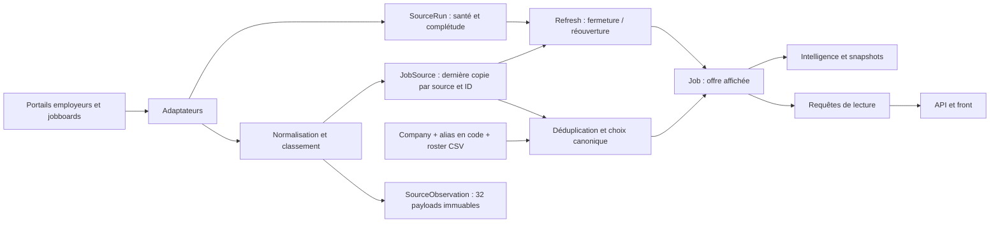

# Annexe technique — preuves et décisions d’architecture

Cette annexe accompagne [le rapport A–E](RAPPORT-REAUDIT.md). Les chiffres proviennent de la production ; les propositions n’ont pas été appliquées.

## 1. Méthode et reproductibilité

- Extraction principale avec [snapshot.sql](snapshot.sql), dans une transaction PostgreSQL en lecture seule et à snapshot répétable. Contrôle de `transaction_read_only=on`. Temps de requête limité à 25 secondes.
- Export de 73 645 Jobs, 76 562 JobSources, 1 556 Companies, 495 Sources, derniers runs et 11 094 runs récents. Les agrégations principales utilisent exclusivement les **71 636 Jobs actifs** du snapshot du 8 septembre à 15:57:38 UTC.
- Compléments : [details.sql](details.sql), [quality.sql](quality.sql), [identity.sql](identity.sql), [brand-counts.sql](brand-counts.sql), [raw-availability.sql](raw-availability.sql). Chacun ouvre sa propre transaction READ ONLY ; les heures peuvent donc différer du snapshot principal.
- Analyse locale des vraies lignes exportées : [analyze.py](analyze.py), [build-deliverables.py](build-deliverables.py). Aucun replay qui écrive en base, aucun run d’ingestion, aucune fixture générée.
- API : 11 combinaisons pays réelles, premières pages de 25 offres ; une page Entreprises France/Beauté. Navigateur : recherche, sélection de filtres, intelligence France, annuaire filtré, catalogue Catwalks et affichage à 390×844. Le changement de largeur ne change aucune donnée ; aucune latence artificielle n’a été injectée.
- Chez les sources : **16 URLs d’annonces** ciblées, plus consultation de portails officiels pour les identités/couvertures. 14 réponses 200, une 410, une 403. Parmi les 200, une annonce indisponible confirmée dans le navigateur. L’échantillon privilégie les anomalies : **2 liens indisponibles sur 16 ne s’extrapolent pas au catalogue**.
- Le RAW exporté est local. Il peut contenir les coordonnées publiques présentes dans les annonces ; le rapport partage surtout IDs, agrégats et preuves minimales. Aucun secret d’accès ne fait partie des livrables.

**Correction de méthode d’audit :** la première agrégation `isFrance IS DISTINCT FROM (countryCode='FR')` comptait les 4 754 pays NULL comme divergences SQL, soit 4 757 lignes. La vraie comparaison booléenne est `isFrance IS DISTINCT FROM COALESCE(countryCode='FR', false)` : **3 divergences**. Ce résultat a été recalculé sur le même snapshot complet et conservé dans `evidence/totals-corrected.json`. `totals.json` conserve le résultat initial pour expliquer l’écart ; la requête d’audit `snapshot.sql` a été corrigée pour les prochaines extractions. Aucun enregistrement de production n’a été corrigé.

**Périmètre Git :** branche `codex/production-hardening-20260908`, HEAD `83ad4eb…` ; déploiement applicatif `b7aa6da…`. Les fichiers applicatifs cités sont ceux de cette livraison ; HEAD ajoute de la documentation. Les changements préexistants dans `apps/aggregator/data` ont été laissés intacts.

## 2. Architecture réellement présente

Le choix d’un PostgreSQL central est cohérent pour ce stade. Le problème est que les niveaux **source, tenant, marque, employeur, offre et republication** ne sont pas suffisamment séparés dans toutes les décisions.

Source a une unicité `tenantKey` ; JobSource a une unicité `(sourceKey, externalId)`. En revanche, deux sourceKeys peuvent publier le même tenant ATS et porter des réquisitions différentes : les égalités/fusions doivent s’appuyer sur l’identité du tenant réel. `Company.canonicalKey` est indexé mais pas unique dans le schéma ; aucun doublon exact de cette clé n’a été observé. L’absence actuelle de doublon ne remplace pas une contrainte et une politique de résolution.

Le modèle Company possède déjà `kind`, `parentGroup`, des alias et des champs carrière. Mais ils ne constituent pas aujourd’hui un référentiel cohérent : kind UNKNOWN partout, alias en code plutôt qu’en table, parentGroup libre, champs carrière non renseignés. Une future relation explicite `SourceCoverage(sourceId, companyId, scope, evidence)` doit permettre de savoir qui un tenant couvre même lorsque la Maison ne publie aucune offre.

### Architecture cible proposée

1. **SourceListing** : identifiant stable `(tenantId, externalId)` ; les copies de jobboards sont des représentations de cette annonce quand une équivalence est prouvée.
2. **SourceObservation immuable** : RAW utile, hash, date de collecte, URL, statut HTTP, contenu et version d’adaptateur. Conserver séparément le dernier constat de présence et la dernière preuve d’absence.
3. **CanonicalJob** : projection déterministe de preuves identifiées, avec `ruleVersion`, `referenceVersion`, version de la confiance des champs et raison de sélection. Une valeur inconnue reste inconnue.
4. **FieldDecision** : dimension, valeur canonique, valeur/chemin RAW, méthode, source et observation, confiance qualifiée, contradictions, date de décision. Les nombres 0,9/0,95/1 d’une règle ne sont pas des probabilités calibrées.
5. **Entity** : marque, groupe, enseigne, employeur légal séparés ; alias explicites et datés ; identité indépendante du logo et du domaine de carrière.
6. **Lecture commune** : politique de visibilité, filtres et facettes partagée par résultats, profils, intelligence et SEO. Les agrégats gardent leur périmètre, unité et date de calcul.

L’ingestion doit rester idempotente et incrémentale. Un état ambigu produit une ligne de revue ; il ne change pas implicitement d’employeur ou de pays pour améliorer un score de complétude. Les migrations futures devront prouver les deltas et préserver les IDs/historiques. Aucun changement de cette architecture n’a été réalisé pendant l’audit.

## 3. Fraîcheur et cycle de vie

### Ce que les dates signifient

| Champ / événement | Sens actuel | Limite |
|---|---|---|
| `firstSeenAt` | Première apparition de la fiche Catwalks | Pas la publication initiale chez l’employeur ; un merge hérite d’un historique |
| `JobSource.lastSeenAt` | Dernière présence observée par cette source | Un listing ou une page encore indexée peut être périmé |
| `Job.lastSeenAt` | Dernière réattestation de la fiche agrégée | Ne dit pas quelles parties du contenu ont été vérifiées |
| `postedAt` | Date de publication extraite | Source et parser peuvent être faux ; les 5 Douglas sont un contre-exemple |
| `updatedAt` | Écriture technique de la ligne | Ne doit pas être exposée comme date de modification chez l’employeur |
| `CHANGED` | Changement de titre, ville, pays, entreprise ou métier | Pas d’événement détaillé pour description, salaire, contrat, séniorité ou workplace |
| `closedAt` / `CLOSED` | Fermeture décidée chez Catwalks | Pas l’heure exacte de fermeture chez l’employeur |
| `reopenedCount` / `REOPENED` | Réactivation d’une fiche fermée | Peut venir d’un incident antérieur ; ne prouve pas une republication intentionnelle |

Fichiers : [jobEvents.ts](/Users/lmelane/Downloads/catwalks-job-aggregator/apps/aggregator/src/pipeline/jobEvents.ts:22), [refresh.ts](/Users/lmelane/Downloads/catwalks-job-aggregator/apps/aggregator/src/pipeline/refresh.ts:62), [upsert.ts](/Users/lmelane/Downloads/catwalks-job-aggregator/apps/aggregator/src/dedup/upsert.ts:109).

La programmation Railway observée est quotidienne pour l’ingestion (22 h UTC) et le refresh (2 h UTC), hebdomadaire pour reconcile (lundi 3 h UTC). Les anciens intervalles de 4 h et les passages manuels présents dans SourceRun ne garantissent pas une fraîcheur de 4 h pour le futur.

### Erreurs et fermeture

- HTTP 404/410 : erreur terminale du fetch, sans retry automatique. Cela **ne crée pas à lui seul une transition CLOSED** pour un Job. Il faut distinguer la page d’une annonce de l’URL d’un listing.
- 403/405/429 et certaines 5xx : retries bornés, ralentissement par hôte ; challenge WAF distingué. Un 403 n’est pas une absence.
- Timeout : budgets réseau et source, annulation coopérative ; enregistrement d’un SourceRun TIMEOUT/ERROR/CHALLENGED avec `canAttestAbsence=false`. Le worker reste occupé jusqu’à la terminaison des entrées-sorties : ce n’est pas une isolation de processus.
- Attestation : exige `complete=true`, pas d’erreur, pas de troncature, au moins 90 % du volume déclaré lorsqu’il existe, et pas d’effondrement sous 50 % du précédent volume productif.
- Refresh : dernière attestation positive récente, absence depuis plus de 48 h et aucune représentation encore active. Garde de fermeture massive : plus de 50 % du catalogue et au moins 50 offres ; elle ne remplace pas une analyse de disparition massive par source.
- **`validThrough` n’est pas utilisé par le refresh actuel**, malgré un commentaire de schéma qui l’annonce. La date seule ne devrait pas non plus ordonner une fermeture aveugle.

Fichiers : [http.ts](/Users/lmelane/Downloads/catwalks-job-aggregator/apps/aggregator/src/lib/http.ts:190), [ingestOrchestrator.ts](/Users/lmelane/Downloads/catwalks-job-aggregator/apps/aggregator/src/pipeline/ingestOrchestrator.ts:145), [attestation.ts](/Users/lmelane/Downloads/catwalks-job-aggregator/apps/aggregator/src/pipeline/attestation.ts:87).

**Conclusion sur la fermeture abusive :** la règle de protection est présente et les invariants d’état mesurés sont cohérents. Le nouvel historique n’est pas suffisamment renouvelé pour affirmer « jamais » sur les 440 sources. Ne pas tester en provoquant une panne : observer les prochains échecs/rétablissements naturels et leur effet sur les états, avec journal de décision.

**Offres fantômes vérifiées :** Hermès `cmtk2abeb0p10nv2b0nq0e1pj` affiche dans le navigateur un statut indisponible avec HTTP 200 ; Browns `cmtlymjcm0f8zqf5k34knxkg8` répond 410. La page Hermès indexée par le moteur de recherche était encore une ancienne version ouverte : le constat du navigateur actuel prévaut. Une autre URL L’Oréal répond 403 depuis le poste d’audit : elle reste **indéterminée**, sans conclusion de fermeture.

À mesurer ensuite sur activité réelle : âge depuis dernière preuve positive, âge depuis première absence confirmée, délai observation → projection → front, fréquence des erreurs par hôte, part de catalogue UNKNOWN et délai de rétablissement. Le délai absolu depuis fermeture source ne peut être connu que lorsque la source fournit cette date.

## 4. Doublons et fusions

### Règles actuelles

Le blocage s’effectue sur entreprise résolue + ville. Le matcher compare titre exact ou similarité ≥ 0,72 ; un concept métier commun peut porter la similarité à 0,8. Veto pour deux IDs différents dans la même source, pays explicitement contradictoires, manager/adjoint, horaires distincts et écart de publication >45 jours. Le propriétaire canonique privilégie le tier et conserve le propriétaire en cas d’égalité dans le nouveau sélecteur.

Fichiers : [match.ts](/Users/lmelane/Downloads/catwalks-job-aggregator/apps/aggregator/src/dedup/match.ts:175), [upsert.ts](/Users/lmelane/Downloads/catwalks-job-aggregator/apps/aggregator/src/dedup/upsert.ts:200), [canonical.ts](/Users/lmelane/Downloads/catwalks-job-aggregator/apps/aggregator/src/dedup/canonical.ts:12).

Ces protections sont utiles. Elles ne réparent pas les mauvaises fusions déjà enregistrées ; le chemin exact `(sourceKey, externalId)` peut continuer de réattester leur fiche existante. Une ville vide est un blocage particulièrement faible ; le même métier ne suffit pas à identifier une réquisition.

### Mesures sur tout le stock actif

| Règle de rapprochement | Groupes | Lignes concernées | Excédent SI tout était doublon |
|---|---:|---:|---:|
| Même URL d’annonce normalisée | 33 | 72 | 39 |
| Même entreprise + fingerprint | 3 365 | 8 937 | 5 572 |
| Même entreprise + titre normalisé + ville + pays | 4 601 | 11 948 | 7 347 |
| Même ensemble précédent + hash de description | 3 030 | 7 718 | 4 688 |

La normalisation d’URL enlève les fragments et paramètres de suivi listés dans [analyze.py](analyze.py), pas les identifiants de réquisition. Parmi les 33 groupes d’URL : **26 groupes / 58 lignes / 32 copies surnuméraires confirmées** ont même employeur, titre, ville, pays et description. Ce sont Lumentee, Alberto, Kastner & Öhler, Boardriders et Hermès. Les six groupes Tiffany ont été exclus de cette borne conservatrice en raison des fusions croisées, et Aroma-Zone parce que les contenus diffèrent. Tous les verdicts sont dans [doublons-urls-revue.csv](tableaux/doublons-urls-revue.csv).

Il n’y a **pas de mesure certifiée du taux global de vrais doublons**, ni de taux validé de faux négatifs du matcher. Les grands groupes de similarité comprennent des recrutements distincts : descriptions standardisées, horaires, boutiques, numéros de réquisition et campagnes différents. Le dénominateur réel est connu ; l’identité métier de toutes les paires ne l’est pas. Il faut une adjudication sur les vraies paires avant toute suppression.

**2 772 offres actives ont plusieurs JobSources actives.** Parmi elles, 38 fusionnent des URLs Oracle portant plusieurs numéros d’annonce : [fusions-identifiants-oracle.csv](tableaux/fusions-identifiants-oracle.csv). Ce n’est pas un taux de 38 fusions nécessairement toutes fausses, mais une cohorte précise à instruire.

Exemple décisif :

| Job Catwalks | Source Tiffany Oracle | Source LVMH rattachée |
|---|---|---|
| `cmtrslaab1615pg5m8dosnymn` | 63763 — CDD Client Advisor, Paris | 63762 — Senior Client Advisor, Gold Coast |
| `cmtrsla9p1610pg5mo0wtb1id` | 63762 — Senior Client Advisor, Gold Coast | 63763 — CDD Client Advisor, Paris |

D’autres cas portent Istanbul Store Manager / Assistant Store Manager et Rockefeller Center / Manhasset. Le lien de candidature, le pays et le contenu doivent rester attachés à la même réquisition. Une séparation devra conserver les historiques et un journal de correction, pas détruire puis recréer le catalogue.

**Reposts :** 68 Jobs ont été réouverts, dont 17 dans le périmètre France affiché. L’intelligence les présente comme un « taux de repost ». Ce terme est excessif : retour après fermeture, nouvelle campagne avec nouvel ID et mise à jour d’une annonce sont trois événements différents.

## 5. RAW → règle → canonique → provenance → confiance

| Dimension | Règle actuelle / preuve réelle | Canonique et traçabilité | Décision recommandée |
|---|---|---|---|
| Pays | Code/nom RAW, nom dans location, contexte de subdivision ; `resolveGeography` renvoie méthode, chemin et coefficient | FR pour RAW FR ; mais Bruxelles/RAW France reste une contradiction. Méthode/chemin/coefficient ne sont pas persistés par champ sur tout Job | Conserver les deux preuves et la contradiction ; ne pas traiter coefficient 1 comme vérité vérifiée |
| Ville/région | Normalisations et géocodage ; `GeoCache`, identifiants INSEE ; subdivisions surtout US/CA | 70 450 villes renseignées ne sont pas 70 450 villes validées. France, Hérault, Haute Garonne et zones commerciales peuvent occuper city | Localisation structurée multi-sites ; source, niveau administratif et identifiant stable ; aucun choix de commune à partir d’un département seul |
| Sur site/hybride/remote | Mapping du champ déclaré ; WTTJ `punctual` devient ONSITE selon définition interne | 5 838 valeurs connues ; RAW parfois absent. Pas de décision détaillée par valeur conservée | Garder « télétravail ponctuel » comme nuance ; unknown distinct de onsite ; ne pas déduire du métier |
| Métier | `classifyFunction(title, department)` ; règles ordonnées et multilingues | 66 531 classés, version 2 partout. Exemples à revoir : développeur de flux rangé Supply Chain, intitulés IT influencés par un département bruité | Persister règle déclenchée et éléments textuels ; distinguer erreur prouvée et revue contextuelle |
| Séniorité | Regex de niveau, puis `return MID` | 48 601 MID ; affichage « Confirmé » sans preuve spécifique de niveau | Retour UNKNOWN/NULL faute de preuve ; expertise et management d’équipe séparés |
| Contrat/rythme/programme | `employment.ts`, preuves explicites/inférées et confiance du champ source | Modèle propre, mais décisions par Job insuffisamment expliquées. PVH `employmentType` : 543 contradictions sur 753 observations éligibles pour workTime, pas sur tous les Jobs PVH | Conserver RAW, chemin, règle, preuve contradictoire et snapshot de confiance utilisé ; ne pas déplacer une erreur dans une autre dimension |
| Secteur/univers | Référentiel 728 + règles + héritage du catalogue | `fromCatalogue` suppose le secteur déjà établi ; VIA/ASHOKA démontrent que la promotion seule ne le garantit pas | Valider l’acteur et le périmètre du tenant ; ne pas hériter aveuglément du label d’une source |
| Maison | Alias code, clé normalisée, fallback sur `Source.maison` | SMCP : `customField[fieldLabel=Brands].valueLabel=Maje` mais Company=Sandro, **148 cas** ; preuve indépendante déjà disponible | Lire la marque structurée et la relier à une identité, sans créer 4 collectes du même tenant |
| Groupe | `maisons.csv` puis alias ; `parentGroup` libre | 34 libellés distincts, pas de FK groupe ; plusieurs variantes L’Oréal | Relation explicite, versionnée et prouvée ; groupe inconnu distinct d’indépendant |
| Enseigne / employeur légal | `CompanyKind` disponible mais UNKNOWN partout | Impossible de compter séparément ces populations ; noms de succursales et raison sociale peuvent fragmenter les identités | Distinguer ces niveaux et leur relation ; ne pas assimiler domaine commun à entreprise identique |

Fichiers : [geography.ts](/Users/lmelane/Downloads/catwalks-job-aggregator/apps/aggregator/src/normalize/geography.ts:304), [employment.ts](/Users/lmelane/Downloads/catwalks-job-aggregator/apps/aggregator/src/normalize/employment.ts:58), [taxonomy.ts](/Users/lmelane/Downloads/catwalks-job-aggregator/apps/aggregator/src/normalize/taxonomy.ts:266), [company.ts](/Users/lmelane/Downloads/catwalks-job-aggregator/apps/aggregator/src/normalize/company.ts:32), [upsert.ts](/Users/lmelane/Downloads/catwalks-job-aggregator/apps/aggregator/src/dedup/upsert.ts:133).

### Cas géographiques localisés

- Tourcoing : `cmtp1wbd102dxqq4z33d3co5a`, `cmtp1wbdb02e1qq4zqbedsx3e` ; RAW FR, canonique FR, flag false.
- Bruxelles : `cmtk48jfp1e0lny2bsc60qmw9` ; RAW LVMH France, libellé Bruxelles Belgique, canonique FR, flag false. À arbitrer sur la page employeur.
- Nocibé : quatre fiches `cmtpj23y513evpf5l58p2vq61`, `cmtpj23yp13ezpf5lljcum8zt`, `cmtpj23z713f3pf5lnhefdnsd`, `cmtpj26wt13yfpf5l3smpava9` mentionnent Île-de-France/code postal mais sans pays canonique.
- Population de codes à risque : AZ 20, VA 27, GA 20, KY 20, TN 18, NH 3. **Les effectifs sont ceux des codes, pas des erreurs toutes démontrées.** CA et AR contiennent plusieurs interprétations légitimes ; l’inventaire doit rester distinct de la fonction pure.
- La liste de 22 cas France à relire contient volontairement aussi des faux positifs de recherche, tels que Paris au Texas et une adresse suisse contenant « Route de France ». Elle n’est pas un backfill prêt à exécuter.

## 6. Cohérence du front et des lectures

### Chaîne de comptage

[searchSummary](/Users/lmelane/Downloads/catwalks-job-aggregator/apps/web/lib/job-search-query.ts:23) produit les IDs, le total et les facettes dans une requête à ensemble matérialisé. C’est le bon principe. France utilise cependant `isFrance`, les autres pays un dictionnaire de variantes de `countryCode`. Cette différence est reproduite dans plusieurs lecteurs : elle explique les 3 divergences plutôt qu’une perte de plusieurs milliers dans l’API.

La page `/intelligence/pays/FR` affiche bien 9 636, 479 identités et 863 villes. Elle reconnaît l’insuffisance d’historique pour plusieurs indicateurs 7/30 jours. Elle affiche néanmoins une durée médiane de publication de 1 jour sur un historique très jeune, et nomme réouverture « repost » : interprétation à encadrer.

### Défauts front vérifiés

- [search-pill.tsx](/Users/lmelane/Downloads/catwalks-job-aggregator/apps/web/components/search-pill.tsx:82) promet « Ville, région ou pays », mais sa valeur devient une ville. Recherche réelle France : **10**, filtre pays : **9 636**.
- [companies.ts](/Users/lmelane/Downloads/catwalks-job-aggregator/apps/web/lib/companies.ts:214) calcule des facettes secteur mondiales en nombre de Jobs ; [companies-view.tsx](/Users/lmelane/Downloads/catwalks-job-aggregator/apps/web/components/companies-view.tsx:132) les juxtapose au total de Companies filtrées. Exemple : Toutes 48 / Beauté 17 318.
- Le groupement des villes par `(companyId, city, latitude, longitude)` produit sur la carte de Parfums Christian Dior **Neuilly-sur-Seine (80) puis Neuilly-sur-Seine (19)**.
- [format.ts](/Users/lmelane/Downloads/catwalks-job-aggregator/apps/web/lib/format.ts:45) arrondit la différence en jours de 24 h. Il faut choisir et afficher clairement jour calendaire local ou durée écoulée.
- Les pays douteux sont exposés sans état de qualité ; le menu n’offre pas de pays « inconnu ». Les 65 798 modalités inconnues ne doivent pas être présentées comme sur site. Le front ne propose pas toutes les dimensions de filtre pourtant canoniques : métier, seniorité, rythme, programme et workplace.
- L’interface ne distingue pas nettement « dernière vérification » de « publication ». Les dates futures Douglas dominent le tri par `postedAt`.

### Risques lus dans le code, non reproduits artificiellement

- [jobs-view.tsx](/Users/lmelane/Downloads/catwalks-job-aggregator/apps/web/components/jobs-view.tsx:170) et [companies-view.tsx](/Users/lmelane/Downloads/catwalks-job-aggregator/apps/web/components/companies-view.tsx:69) ajoutent les réponses de pagination sans jeton de recherche ni annulation au changement de filtre. Une réponse ancienne peut contaminer la nouvelle liste. Aucun test par ralentissement artificiel n’a été exécuté.
- Le classement d’entreprises tranche les égalités **après** découpage en pages : stabiliser le tri SQL par identifiant avant pagination. Les Jobs ont déjà un départage par ID dans la requête commune.
- Le profil Maison est résolu à partir d’un slug de nom, puis prend la première ligne lexicographique. Ce n’est pas l’identité canonique stable promise par le commentaire. Il faut un slug unique attaché à l’entité. Ce risque n’est pas compté comme collision constatée en production.
- La lecture des objets Jobs suit la requête de compteurs hors transaction commune : un changement concurrent peut créer un écart transitoire. Aucun écart transitoire de ce type n’a été constaté pendant les lectures de l’audit.

### Audit technique visuel, périmètre limité

Le skill Impeccable a été utilisé en lecture seule. Le détecteur local a remonté **une animation de largeur** sur `nav-progress.tsx:61`. C’est une barre fixe de 2 px, isolée : le signal est réel mais la gravité automatique « layout thrash » est excessive ici. Aucun ralentissement utilisateur n’a été mesuré. Priorité P2 ; `transform: scaleX` est une amélioration possible.

| Dimension | Note indicative /4 | Preuve / limite |
|---|---:|---|
| Accessibilité | 2 | Labels/combobox/landmarks présents ; pas de H1 sur la page résultats ; bouton mobile Filtres de 36 px face à la cible interne de 44 px ; pas de certification WCAG complète |
| Performance d’implémentation | 2 | Lectures groupées et pagination présentes ; plusieurs agrégations/global scans ; pas de mesure de charge ni de Core Web Vitals dans cet audit |
| Responsive | 3 | Aucun débordement sur le parcours à 390 px, filtres fonctionnels ; tailles tactiles à améliorer |
| Thème / cohérence graphique | 3 | Tokens et direction Corporate Elegance en place, accent contrasté ; aucun besoin de refonte de DA établi |
| Intégrité de l’interface | 1 | Sémantique de France et des compteurs Maisons incorrecte ; indicateurs de fraîcheur trop implicites |

**11/20 sur ces observations limitées, et non un score de disponibilité ou de qualité de toute la production.** La qualité visuelle ne compense pas une mauvaise unité ou un lien d’offre croisé. Le réglage mobile a été réinitialisé. Le mode réduction d’animations repose encore sur une désactivation globale à 1 ms ; garder les changements d’état perceptibles sans mouvement lors d’une passe d’accessibilité dédiée.

Actions UI adaptées : `$impeccable harden` pour filtres/pagination, `$impeccable clarify` pour unités/fraîcheur, `$impeccable adapt` pour cibles tactiles, puis `$impeccable polish`. Elles pourront être exécutées séparément après décision de correction, avec un nouvel audit du résultat.

## 7. Sources : fiabilité mesurée plutôt que score décoratif

**440 tenants de catalogue actifs**, dont 235 déclarés EMPLOYER_DIRECT, 184 ATS_OFFICIAL, 17 GROUP_OFFICIAL et 4 SPECIALIST_JOBBOARD. Les **436 premiers sont des origines déclarées officielles**, pas 436 portails carrière indépendamment authentifiés pendant ce réaudit. Les 38 familles comprennent par exemple Workday, Lever, Greenhouse, SmartRecruiters, Teamtailor et SuccessFactors, mais aussi WTTJ, FashionJobs, generic-listing et des portails spécifiques. La liste exacte est exportée.

Derniers statuts : **434 OK, 5 DEGRADED, 1 BROKEN**. Parmi les OK, seuls trois derniers runs portent pour l’instant les nouveaux champs positifs de complétude/attestation. Santé technique et qualité du contenu doivent rester deux axes distincts.

| Source | Actives liées | Problème observé |
|---|---:|---|
| `b2` | 67 | Dernier run 0 après 66 : BROKEN ; préserver les annonces jusqu’à preuve de disparition |
| `burnt` | 8 | Dernier run 3 après 8, chute de 63 % |
| `foot-locker-france` | 2 835 | 2 835 collectées / 2 846 déclarées, troncature |
| `lagardere-travel-retail` | 21 | 20 collectées / 109 déclarées ; couverture incomplète prouvée |
| `jako` | 20 | Aucune description sur le dernier run |
| `urbn-stores` | 934 | 915 collectées, descriptions 63 %, dates et pays RAW 0 % |

Le classement de [sources-et-risques.csv](tableaux/sources-et-risques.csv) utilise une **union d’IDs**, pas une moyenne de coefficients : pays inconnu, non réobservé depuis 48 h, expiration passée, date future, conflit Oracle, attribution SMCP contredite, homonyme hors secteur ou répétition confirmée de page. `a_revoir_union_sans_double_compte` mesure un travail de qualification, **pas le nombre d’offres nécessairement fausses**.

Exemples : Boots 1 499/1 506 offres à revoir, principalement sans pays ; L’Oréal 1 237/1 804 ; Luxe Talent 478/478 sans pays ; FashionJobs 364/757 non réobservées depuis 48 h ; Sandro 275/557 avec marque contradictoire ; VIA 155/155 hors identité attendue. Les mêmes Jobs peuvent avoir plusieurs sources : ne pas additionner les lignes du CSV comme un total mondial.

58 sources actives portent le verdict historique « ALLOWED (no robots.txt reachable) », quatre « UNKNOWN (no domain) ». D’autres ont des notes d’autorisation explicites. La nouvelle promotion exige un verdict ALLOWED daté, mais cela ne remplace ni les preuves d’identité ni la conservation structurée des autorisations existantes. **Aucune autorisation connue n’a été révoquée ou redemandée pendant cet audit.**

## 8. Procédure existante pour ajouter une Maison et ses sources

La procédure existe déjà ; **elle n’a pas été exécutée en mode écriture pendant cet audit**.

1. **Référentiel d’identité** — [maisons.csv](/Users/lmelane/Downloads/catwalks-job-aggregator/apps/aggregator/data/maisons.csv) : nom, slug, segment, groupe, source et confiance. Chargement par [maisons.ts](/Users/lmelane/Downloads/catwalks-job-aggregator/apps/aggregator/src/normalize/maisons.ts:68). Alias explicites dans [company.ts](/Users/lmelane/Downloads/catwalks-job-aggregator/apps/aggregator/src/normalize/company.ts:32). Les champs ne doivent pas être devinés depuis un slug ATS.
2. **Découverte à partir du domaine officiel** — [discoverMaisons.ts](/Users/lmelane/Downloads/catwalks-job-aggregator/apps/aggregator/src/discovery/discoverMaisons.ts) cherche les liens carrière, suit une étape et produit des fichiers de progression/résolution. Cette étape peut écrire des CSV ; elle n’a pas été lancée ici.
3. **Gate d’identité** — [gateDiscovered.ts](/Users/lmelane/Downloads/catwalks-job-aggregator/apps/aggregator/src/discovery/gateDiscovered.ts) vérifie l’ancrage domaine/nom et sépare validation, revue manuelle et hôtes morts. Attention aux homonymes : Via, Ashoka et le portail « Messika Demo » montrent pourquoi le nom seul ne suffit pas.
4. **Validation de collecte** — [validateDiscovered.ts](/Users/lmelane/Downloads/catwalks-job-aggregator/apps/aggregator/src/discovery/validateDiscovered.ts) fait passer les adaptateurs et produit volumes/échantillons/localisations. Un portail identifié n’est pas encore un connecteur validé.
5. **Préparation de promotion** — [promoteValidated.ts](/Users/lmelane/Downloads/catwalks-job-aggregator/apps/aggregator/src/discovery/promoteValidated.ts) utilise les rapports. La preuve positive de volume et de lieu doit concerner le bon acteur ; un unique poste d’un homonyme ne valide pas une Maison.
6. **Catalogue et activation** — [sourceStore.ts](/Users/lmelane/Downloads/catwalks-job-aggregator/apps/aggregator/src/connectors/sourceStore.ts:144) importe de nouvelles sources en DRAFT sans écraser les existantes. `promoteSource` exige configuration, verdict daté, ALLOWED et au moins une annonce validée ; interdit la promotion directe d’une RETIRED. La fonction peut aller de DRAFT/VALIDATED/PAUSED à ACTIVE : ne pas supposer que chaque passage a une ligne VALIDATED persistante.
7. **Contrôle après activation, à prévoir lors de la phase de correction** — première collecte réelle ciblée, vérification des identités et lieux, IDs uniques, pagination/complétude, statut de fraîcheur, comparaison source → base → API → front. Une activation ne doit pas être déclarée réussie au seul motif qu’elle a écrit au moins une ligne.

### Renforcements à apporter à cette procédure

- Stocker l’URL et la date de la preuve officielle de propriété du tenant, le groupe et le périmètre géographique ; ne pas les laisser seulement en notes/CSV.
- Relier explicitement le tenant aux entités couvertes ; un tenant SMCP n’est pas un tenant Sandro, et un tenant groupe n’exige pas un connecteur par marque.
- Conserver les résultats de validation et leurs versions ; mesurer pages terminées, erreurs de détail et IDs uniques, pas seulement volume positif et présence d’un lieu.
- Unifier le statut de robots/autorisation et son motif en champs structurés ; garder les autorisations utilisateur existantes.
- Qualifier les champs de marque, pays et date avant activation ; documenter les inconnus plutôt que forcer une valeur.

Les **38 dossiers** ne sont pas 38 activations prêtes. Certains établissent un portail officiel exploitable, d’autres une identité sans flux, d’autres une erreur d’attribution déjà collectée. Les cases NON_VERIFIE/NON_ETABLI sont intentionnelles. Le rapprochement FHCM est une aide de recherche, pas un merger automatique.

## 9. Ce qui n’est pas établi par cet audit

- Le nombre exhaustif d’offres réellement ouvertes du secteur mondial, faute de référentiel externe complet et de validation de chaque annonce chez chaque employeur.
- Un taux global certifié de doublons, de faux merges, d’erreurs de pays ou de métiers ; seuls les cohortes et cas explicités sont démontrés.
- L’exhaustivité des Maisons France ou monde : 728 noms de référence, 94 fiches FHCM et 61 pages Catwalks ne constituent pas un recensement universel.
- Les latences exactes de fermeture/modification chez les employeurs quand ils ne publient pas ces dates.
- Une garantie de scalabilité « 100 % » ou de disponibilité sans erreur ; aucun test de charge, incident provoqué ou certification de capacité n’a été effectué.

La décision utile est de corriger d’abord les identités et les liens, puis de prouver la fraîcheur et la projection canonique sur les runs ordinaires. C’est cette preuve qui permettra d’élargir le catalogue sans amplifier ses défauts.
