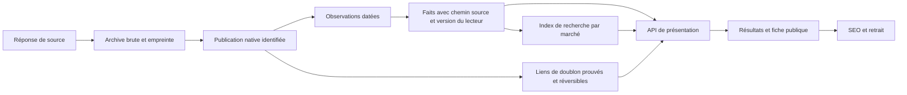

# J. Plan de reprise et critères de livraison

## Règles de travail

Plan mis à jour le 15 septembre 2026 après les précisions produit. L’audit initial est livré. L’état d’exécution est consigné par lot ; les critères ci-dessous ne sont pas des déclarations de mise en production.

L’[architecture maintenue](../../docs/architecture/production-foundations.md) définit le RAW, les deux origines, la priorité Catwalks, les deux inputs, le pays actif et le parcours unique des sources. Toute intervention UX/UI applique le skill `catwalks-dev` du projet.

1. Partir des publications natives et de leurs observations. Les classifications doivent pouvoir être recalculées sans toucher à la preuve originale.
2. Garder un seul contrat par notion. Remplacer les copies manuelles par un paquet/version de contrat consommable par le website ; ne pas laisser deux systèmes actifs indéfiniment.
3. Chaque lot comprend code, migration éventuelle, reprise des données, appelants, tests, documentation et suppression des chemins remplacés. Une colonne ajoutée sans remplissage ni consommateur n’est pas un lot terminé.
4. Les écritures de répétition restent locales ou sur un environnement Railway de test explicitement isolé. Aucun test avec wipe/reset sur les bases réelles.
5. Tout témoin critique nouveau doit passer par une contre-épreuve : fixture pertinente → version corrigée verte → défaut réintroduit dans une copie de test contrôlée → rouge attendu → restauration → diff vérifié. Ne pas écraser le travail existant.
6. Website/backend/media restent locaux. L’agrégateur peut être poussé selon l’autorisation donnée, après validation de son lot ; cela ne vaut pas autorisation d’activer les crons ou de modifier les autres productions. Les migrations de données et bascules de production font l’objet d’un périmètre concret séparé.

## Architecture cible minimale

Ce schéma décrit la branche agrégateur. Les offres publiées directement par les Maisons alimentent la même projection de recherche via leurs versions publiques ; le backend garde les candidatures. Le contrat complet et les règles pays/langue sont dans l’architecture maintenue.

### Sens précis des entités

- **Publication native** : identité source/tenant/identifiant d’annonce, URLs natives, un ou plusieurs lieux, langue originale. Deux annonces distinctes d’un même employeur restent distinctes sans preuve du contraire.
- **Observation** : réponse ou élément source, date de capture, HTTP/provenance, empreinte, version du collecteur, état d’énumération et erreurs. Une réponse identique peut être dédupliquée par contenu tout en conservant les attestations successives.
- **Fait** : valeur native, chemin dans la preuve, interprétation typée et version du lecteur. Null et raison d’absence distincts : non publié, non collecté, non interprété, invalide, conflit.
- **Enrichissement** : métier, famille, langue détectée, secteur ou géocodage inféré. Stocké séparément, avec provenance ; jamais présenté comme déclaration de l’employeur par défaut.
- **Rapprochement** : lien exact confirmé, hypothèse à revoir, ou rejet. La recherche peut grouper des représentations de la même annonce ; la preuve et les champs ne sont pas détruits par ce regroupement.
- **Présentation** : choix de valeurs tracé, labels selon langue UI et dimension native du marché, accès à la source. Une URL SEO stable désigne une page ; elle ne crée pas une vérité de données universelle.

Commencer avec PostgreSQL et les composants existants. Une table de tâches durable peut suffire à la première montée en charge. Le choix d’un service de recherche ou de queue supplémentaire doit répondre à une mesure de charge, de pertinence ou de coût.

## Lot 0. Sécuriser et réconcilier les travaux existants

**État : validé localement — [livraison et audit défensif](lot-0.md).** Les correctifs métier suivants ne sont pas inclus dans ce statut.

**Objectif.** Disposer d’une base de travail reproductible sans perdre les correctifs locaux ni les modifications faites dans les conteneurs.

- **Composants :** les cinq dépôts ; PR #168/#160 ; commits locaux recensés ; migration Journal 025 ; scripts d’exploitation et documentation.
- **Dépendances :** photographie Git de cet audit ; vérification de l’activité concurrente avant tout commit.
- **Données :** empreintes initiales, SHAs déployés, release de taxonomie active, checksum des fichiers Journal présents en runtime.
- **Actions :** sauvegarder les travaux par lots cohérents, comparer les patches avant cherry-pick, expliquer chaque divergence local/main/base ; corriger le témoin API qui considère CN inconnu ; préparer un démarrage reproductible depuis une révision nommée.
- **Risques :** double application d’un squash, publication accidentelle depuis main, disparition des modifications éphémères du Journal.
- **Tests / témoin :** checkout de vérification séparé, installation reproductible, suites locales ; audit des migrations requises et présentes ; contre-épreuve CN avec Paris exclu lorsque le marché CN est reconnu.
- **Definition of Done :** chaque travail est rattaché à un commit/patch sauvegardé ; chaque déploiement est relié à sa révision et à ses migrations ; aucune modification utilisateur perdue ; aucun rouge de test non expliqué.
- **Écart levé pendant le lot 0 :** fichiers runtime du Journal récupérés en lecture seule et sauvegardés ; différences exactes avec le local identifiées (moteur et appel depuis la console). Leur remplacement appartient au lot Journal, pas à une copie aveugle du conteneur.

## Lot 1. Rendre le cycle de vie sûr et borné

**État : validé localement — [livraison, preuves et limites](lot-1.md). Reprise du stock distant et release non exécutées.**

**Objectif.** Empêcher toute fermeture/réouverture hors périmètre et appliquer l’expiration déclarée.

- **Fichiers :** `pipeline/refresh.ts`, `refreshScope`, `refreshManifest`, `refreshPlan`, `lifecycle`, `reconcile`, `attestation`, scripts preview/apply et tests.
- **Dépendances :** lot 0 ; ce correctif de sûreté précède la refonte du modèle.
- **Données :** représentations actives, preuve de parcours, dates d’expiration par source, événements, manifeste de mutations exact.
- **Actions :** exprimer les conditions autorisé/exclu dans une même clause ; borner planification, mutations, orphelins et réouvertures ; traiter l’expiration par publication avant agrégation ; distinguer fermeture prouvée et retrait faute de vérification.
- **Risques :** un validThrough ancien d’une représentation ne doit pas fermer une autre représentation encore valable ; source cassée ≠ poste fermé ; réapparition ne doit pas effacer un retrait administratif.
- **Tests / témoin :** les quatre offres de `lifecycle-witness` ; source hors périmètre inchangée avec source cassée présente ; manifeste vide ; source devenue fraîche pendant transaction ; deux représentations dont une expirée ; redémarrage/réexécution sans événement doublé ; négation de chaque garde en contre-épreuve.
- **Definition of Done :** snapshot avant/après exact, ensemble modifié inclus dans le manifeste autorisé ; aucune offre expirée déclarée servie active selon le contrat ; aucune fermeture fondée sur un timeout ; reprise idempotente démontrée.
- **Blocage de sortie :** règle explicite de retrait des offres non vérifiables et durée de conservation ; à définir sur les capacités de chaque source, sans inventer une fermeture employeur.

## Lot 2. Archiver les extractions avant transformation

**État : validé localement et stockage distant vérifié en environnement isolé — [livraison et audit défensif](lot-2.md). Aucune bascule de production.**

**Objectif.** Ne plus perdre le matériau nécessaire à une réparation.

- **Fichiers :** `types.ts`, `lib/http.ts`, `ats/index.ts`, adaptateurs, `dedup/upsert.ts`, `SourceObservation`, `JobSource`, schéma/migrations et rétention.
- **Dépendances :** lot 1 pour sécuriser tout replay ; les contrats du lot 2 préparent les lots 3 à 6.
- **Données :** snapshot RAW conservé, inventaire des 3 538 chemins, corps natifs et métadonnées de futures collectes.
- **Actions :** sauvegarde de capture avant parsing ; séparer payload source et annotations internes ; stocker les rejets et erreurs interprétables ; références de blob et hash ; définir une politique de rétention et de minimisation des secrets de transport.
- **Risques :** volume de stockage, données inutiles dans des pages complètes, doublons de capture, changement de format ; ne jamais archiver cookies/Authorization comme preuve métier publique.
- **Tests / témoin :** réponse JSON et HTML réelles, champ inconnu ajouté, champ imbriqué, tableau multi-lieux, ligne rejetée ; arrêt entre capture et parsing ; replay sans réseau qui retrouve exactement la preuve.
- **Definition of Done :** chaque valeur issue d’une nouvelle ingestion pointe vers une capture stable ; empreinte identique au corps conservé ; preuve disponible même si parsing échoue ; pertes historiques explicitement marquées à recollecter.
- **Blocage de sortie :** support de stockage et budget de rétention mesurés, pas une estimation arbitraire.

## Lot 3. Corriger les quatre dimensions RAW et la réattestation

**État : validé localement — [livraison, mesures et audit défensif](lot-3.md). Rejeu des 85 327 représentations et répétition de reprise sur 257 cas réels. Stock de production non modifié ; les lecteurs non qualifiés restent explicitement signalés.**

**Objectif.** Récupérer les valeurs déclarées sans inventer celles absentes.

- **Fichiers :** `src/facts/`, `packages/db/source-facts.ts`, `trust/resolve.ts`, `dedup/upsert.ts`, Prisma, projection API et CLI de reprise.
- **Dépendances :** lots 1 et 2 ; traiter la migration salaire avant d’activer les nouveaux extracteurs monétaires.
- **Données :** RAW qualifié par ce rapport ; listes des valeurs natives et conflits ; valeurs actuelles et auteur de chaque représentation.
- **Actions :** remplacer Int salarial par Decimal ou minor units avec devise explicitement associée ; enregistrer période/brut-net/source ; lire les diplômes natifs ; résoudre négations et conflits des modes de travail ; préserver tous les lieux ; compléter les mises à jour de réattestation.
- **Risques :** transformer un zéro placeholder en salaire ; annualiser au mauvais facteur ; attribuer similarJobs à l’annonce ; choisir arbitrairement une coordonnée ; écraser une preuve plus récente ou mieux sourcée.
- **Tests / témoin :** Jibe 0, LVMH « To be negotiated », Teamtailor 12.31, Lever bi-weekly, iCIMS sans période, Flatchr show_salary ; Recruitee hybrid=true/remote=false et « No remote » ; diploma absent vs no_diploma ; multi-lieux, 0 latitude valide, (0,0) suspect ; création puis réattestation avec changement de valeur.
- **Definition of Done :** chaque extracteur rejoue sur son corpus ; aucun montant tronqué ; chaque modification du stock a une preuve source et un diff ; taux par marché recalculés sans extrapolation ; valeurs inconnues honnêtes ; API ne prétend pas servir les champs non câblés.
- **Blocage de sortie :** qualification des encodages encore non interprétés, notamment coordonnées texte/GeoJSON et unités monétaires propriétaires.

## Lot 4. Déduplication réversible et identité de publication

**État : en cours. [Sous-lot 4A validé localement](lot-4a.md) : suppression des rapprochements par similarité, identité native immuable et journal de décisions. [Sous-lot 4B validé localement](lot-4b.md) : reprise par plan borné, séparation et restauration réversibles, ancienne commande globale supprimée. [Sous-lot 4C validé localement](lot-4c.md) : présentation complète propre à chaque publication et changements de source atomiques. La reprise du stock historique reste à livrer avant de valider le lot complet ; le lecteur public ne peut être déployé avant remplissage du stock à servir.**

[Sous-lot 4D1 validé localement](lot-4d1.md) : le moteur distingue capture native et RAW historique, sans réattestation ; 19 familles relues, 49 075 présentations constructibles dans le snapshot et 57 publications réelles vérifiées par l’API locale. Les formats restants, les pertes de contenu, les anciennes sémantiques de dates et l’application au stock distant restent à traiter.

[Sous-lot 4D2 validé localement](lot-4d2.md) : 22 familles relues, 49 205 présentations constructibles, dates WordPress/Greenhouse/Recruitee corrigées et 528 rubriques d’exigences restituées. Les 66 publications du scénario local sont relues sans écart par l’API. Les domaines de détail du hub URBN restent à qualifier.

[Sous-lot 4D3 validé localement](lot-4d3.md) : six lecteurs supplémentaires, 28 familles relues et 50 028 présentations constructibles. Les 84 publications du scénario local sont relues sans écart. La fin de contrat Flatchr ne sert plus d’échéance de candidature. Le remplissage RAW des échéances en cache doit précéder la réparation du stock et sa bascule publique ; le moteur de groupes ne le réalise pas.

[Sous-lot 4D4 validé localement](lot-4d4.md) : Easycruit, Harri et TalentRecruiter ajoutent 100 présentations reconstructibles ; total de 50 128 dans 31 familles, avec 93 lectures API locales sans écart. La reprise des échéances fera évoluer l’outil existant `source-expiry.mts` ; aucun circuit parallèle n’est ajouté.

[Sous-lot 4E1 validé localement](lot-4e1.md) : extraction JSON-LD conforme aux attributs HTML non cités, 34 offres Fenwick capturées et rejouées hors réseau avec leurs dates, lecteur d’échéance version 4. Le snapshot historique conserve 50 128 présentations reconstructibles ; les nouvelles collectes ne le réattestent pas. La reprise des échéances en cache reste à livrer.

[Sous-lot 4E2 validé localement](lot-4e2.md) : plan d’échéances version 2, révision calculée, preuve antérieure conservée après capture partielle, retrait borné des deux règles réfutées et cas sans preuve explicitement bloqués. Les 3 043 tests, 11 contre-épreuves et la CLI passent ; aucune reprise du stock distant n’a été exécutée.

[Sous-lot 4E3 — migration et audit du stock complet](lot-4e3.md) : les 11 migrations passent sur la copie de 87 580 offres sans modification du contenu ni des attestations. L’audit révèle 3 210 échéances dont la liaison à l’identité native ou à l’état de publication reste à qualifier. Aucun plan d’échéance n’est appliqué ; ce contrôle doit être ajouté avant la reprise. Les 441 représentations sans registre sont inactives et les 59 redirections historiques restent à préserver.

**Objectif.** Éviter les doublons visibles sans supprimer des postes distincts.

- **Fichiers :** `dedup/match.ts`, `upsert.ts`, `packages/db/publications.ts`, `postingIdentity`, `reconcile`, schéma et API d’identités/redirects.
- **Dépendances :** lots 1 à 3.
- **Données :** sourceKey/externalId/tenant, identifiants de réquisition, URLs, historiques, 59 marqueurs mergedIntoId et représentations des 4 590 offres sans propriétaire désigné.
- **Actions :** identité native immuable ; fusion exacte seulement sur preuve suffisante ; liens probables séparés ; groupement de recherche réversible ; réévaluer les fusions anciennes avec journal de décision et dégroupement possible.
- **Risques :** casser URLs partagées, multiplier visuellement des variantes, rattacher un mandat de cabinet au mauvais employeur.
- **Tests / témoin :** Sales Advisor/Beauty Advisor doivent rester séparés sans preuve exacte ; même réquisition sur ATS + board ; deux postes même titre/ville ; remplacement d’ID, publication renouvelée, variantes de langue ; fusion/défusion sans perte de RAW ou de redirection.
- **Definition of Done :** aucune suppression d’identité ou de preuve par similarité ; chaque groupe explique ses liens ; résolution d’URL stable ; corpus de précision/rappel validé, faux rapprochements revus.
- **Blocage de sortie :** corpus de référence de doublons réels annotés, à constituer depuis les sources, pas depuis les anciennes fusions.

[Sous-lot 4F1 validé localement](lot-4f1.md) : le plan version 3 rattache chaque échéance à son identité RAW et, lorsqu’elle existe, à sa capture native. Les 3 064 tests, 11 contre-épreuves, la CLI et le build passent. Sur la copie complète, 2 939 écritures prouvées sont appliquées et 477 plans rejoués sans réécriture ; 3 210 cas restent en examen, sans modification de contenu ni d’attestation. La réparation des groupes, les présentations et la qualification restante précèdent toujours la bascule.

## Lot 5. Certifier les sources et préparer le cycle complet

**Objectif.** Rendre chaque source du catalogue exploitable ou explicitement exclue.

- **Fichiers :** 43 profils d’adaptateurs, source registry/candidates, enumeration/persistenceContract, source validation, access policy, télémétrie.
- **Dépendances :** lots 1 à 4.
- **Données :** sources.csv et dernières preuves ; raw des nouvelles collectes ; pagination, compte annoncé, IDs, erreurs de détail et limites observées.
- **Actions :** consolider les commandes en un seul parcours dossier/capture/validation/certification/activation ; lier chaque rapport au tenant, à la configuration, au code et au corpus ; retirer les scripts remplacés et le volume de validation saisi manuellement. Faire passer les sources existantes par ces mêmes règles. Commencer par les BROKEN et les plus gros volumes sans preuve d’absence ; qualifier par tenant et non par seule famille ; source sans preuve complète reste « non vérifiable » pour les fermetures ; traiter ensuite les candidats datés et les sources PAUSED/RETIRED.
- **Risques :** anti-bot, seuils de page, instabilité des APIs web, contraintes de réutilisation et changement de DOM ; pas de contournement automatique d’un refus d’accès.
- **Tests / témoin :** première/dernière page, page répétée, trou d’ID, détail en erreur, compte variable pendant capture, 429 Retry-After, 403/challenge, timeout, fin vide légitime ; corpus de fixtures source anonymisées minimalement.
- **Definition of Done :** chaque source dispose d’un verdict daté, identifiants parcourus, coût HTTP, durée, complétude, qualité des champs et règle de lifecycle. Aucun statut ACTIVE confondu avec un droit d’attester l’absence.
- **Blocages :** accès devenu indisponible, propriétaire ambigu, preuve native absente. Documenter ces cas et leur traitement ; ne pas annoncer une certification universelle à partir de la réussite d’un adaptateur.

## Lot 6. Recherche réellement bornée par marché

**Objectif.** Livrer une recherche commune aux deux origines, strictement bornée par pays, pour résultats, facettes, titres, employeurs, villes, divisions et codes postaux.

- **Fichiers :** `apps/api/lib/jobs.ts`, `job-search-query.ts`, `lieu.ts`, suggestions, registre partagé ; website recherche-url/api/marche/sélecteurs.
- **Dépendances :** lots 3 à 5 pour les valeurs et populations stables. Le correctif minimal de cloisonnement peut être préparé plus tôt localement.
- **Données :** pays source, marchés supportés, lieux identifiés avec pays/région, droits géographiques des annonces remote.
- **Actions :** livrer projection publique native, transfert durable versionné et reprise initiale complète ; union des deux origines avant filtres/pagination. Imposer le pays cible dans le périmètre SQL ; aucun repli mondial public sur code absent/invalide. Deux inputs : titre/mots-clés/entreprise issus du stock local, puis lieu administratif/postal ou télétravail dans le pays actif ; aucun pays dans ce second input. Contrat partagé des facettes locales et de leur disponibilité ; filtres inconnus incompatibles avec le pays refusés explicitement.
- **Risques :** confondre langue et pays, rendre invisible le stock hors douze marchés, bloquer les offres multi-pays, réinterpréter silencieusement un lien déjà partagé.
- **Tests / témoin :** origines directe/externe sous les mêmes filtres ; ingestion d’événements natifs dupliqués/désordonnés et retrait rejoué ; reprise de plus de 500 offres natives ; FR/US/CN + lieux homonymes ; France tapée dans marché US ; Paris Texas vs Paris France ; BE/FR transfrontalier ; changement de marché avec filtres anciens ; code inconnu ; aucun élargissement mondial implicite ; total/facettes/pages dans le même périmètre.
- **Definition of Done :** zéro résultat hors périmètre sauf représentation géographique explicitement compatible ; URL partageable ; réponses API et UI identiques ; contre-épreuve du défaut actuel `marche=US → 83 431`.
- **Blocage de sortie :** règles de multi-localisation et remote transfrontalier explicites.

## Lot 7. Pertinence multilingue et performance de recherche

**Objectif.** Trouver les bons postes avec un temps de réponse mesuré.

- **Fichiers :** searchSummary, alias/occupations/countries, index DB, pagination et cache ; moteur externe seulement si la mesure le justifie.
- **Dépendances :** lot 6.
- **Données :** corpus anonymisé de requêtes pertinentes par marché, résultats attendus tirés des annonces ; volumes de 100 k puis 1 M de documents de test réalistes.
- **Actions :** normalisation Unicode/accents conservant le texte original ; analyse linguistique adaptée ; éligibilité commune, priorité stricte aux offres Catwalks, puis pertinence titre/maison et fraîcheur dans chaque origine ; cursor pagination stable ; budgets de requêtes/index et facettes.
- **Risques :** élargissement d’alias qui dégrade la précision, classement imposant une traduction, index trop coûteux, cache qui mélange des marchés.
- **Tests / témoin :** école/ecole, casse, intitulés locaux, requêtes chinoises sans espaces, marque/groupe, huit termes, joker littéral, filtres OR/AND, pagination avec nouvelles insertions ; comparaison de pertinence annotée et charge concurrente.
- **Definition of Done :** objectifs de précision et latence définis avant optimisation puis atteints sous charge ; plans SQL et mémoire documentés ; aucune page sautée/doublée selon contrat du curseur ; dépendances de fichiers vérifiées dans l’image livrée.
- **Blocage de sortie :** SLO et budget matériel/coût à fixer avec mesures initiales ; aucun chiffre de p95 inventé.

## Lot 8. Langue UI et vocabulaire de marché de bout en bout

**Objectif.** Le pays détecté donne le contexte initial ; le choix manuel de pays actualise la langue par défaut, les offres et toute la recherche. Les pays multilingues permettent une langue disponible explicite sans changer de catalogue.

- **Fichiers :** website middleware, langue/serveur/messages, AppliquerLangue, Header/Footer/Hero, PageEmplois, facettes, projections API et pages légales.
- **Dépendances :** lots 6 et 7 ; aucune refonte visuelle nécessaire pour corriger le contrat.
- **Données :** registre FR/EN réel ; catalogue des chaînes, termes natifs des douze marchés ; traductions validées avant toute nouvelle langue déclarée.
- **Actions :** pays d’URL explicite prioritaire ; sur entrée neutre choix mémorisé puis IP de confiance, sinon sélecteur. Changement de pays → langue locale par défaut et nettoyage des filtres/lieux incompatibles. URL/cache/lang HTML cohérents, sous-domaines pays et alternatives linguistiques validées. Catalogues d’interface versionnés ; toute traduction d’annonce reste dérivée du RAW, traçable et invalidée quand l’original change. Vérifier le fournisseur Indeed avant toute affirmation ; choisir un service sur corpus réel si nécessaire.
- **Risques :** généraliser headers() au layout et supprimer ISR, rerégression useSearchParams au build, faux hreflang, traduction de noms propres, changement de marché lors d’un changement de langue.
- **Tests / témoin :** matrice FR/EN × FR/US + tous marchés existants ; entrée directe /en sans cookie ; choix cookie contradictoire avec URL ; aller/retour, liens, erreurs, listes vides ; HTML sans JS ; cache/RSC ; /reset-password, /mes-jobs, /maisons/[slug] ; règle D-319.
- **Definition of Done :** aucune chaîne non traduite dans le périmètre livré ; aucune fausse langue déclarée ; devise et unités intactes ; builds et navigation réels ; marqueurs légaux conservés. DE/zh-CN restent explicitement non disponibles jusqu’à leur lot de traduction complet.
- **Blocage de sortie :** validation des nouveaux catalogues linguistiques ; statut juridique conservé tant qu’il n’est pas levé explicitement.

## Lot 9. Livrer le SEO du catalogue stabilisé

**Objectif.** Une chaîne vérifiable par offre : disponibilité → fiche → balisage → découverte → mise à jour/retrait.

- **Fichiers :** /emplois/[id], métadonnées, schema JobPosting, sitemaps, robots/hreflang, redirects, indexation et événements de lifecycle.
- **Dépendances :** lots 1 à 8 ; aucune ouverture d’indexation anticipée.
- **Données :** dates source, employeur, lieux, statut, texte réel et preuve de rémunération si affichée.
- **Actions :** réutiliser le validateur JobPosting comme consommateur réellement branché ; canonicals stables ; un traitement par fermé/retiré/fusionné/inconnu ; sitemap paginé du seul stock éligible ; notifications de changements rejouables ; exclusion des recherches pauvres/combinatoires.
- **Risques :** des centaines de milliers de pages sans contenu utile, doubles surfaces, métadonnées différentes du texte affiché, retrait perdu après panne.
- **Tests / témoin :** HTML réel, script JSON-LD échappé, annonces actives/expirées/multi-lieux/source inconnue, robot sans JS, HTTP et canonical, sitemap sans offre inéligible, versions de langue réelles ; inspection des exemples avant toute diffusion large.
- **Definition of Done :** contrat testé de bout en bout localement ; aucune date inventée, aucun salaire estimé balisé comme réel ; politique de retrait vérifiée ; bascule publique préparée et limitée.
- **Blocage de sortie :** autorisation explicite d’une bascule website/production, distincte du droit de pousser l’agrégateur.

## Lot 10. Orchestration durable et exploitation quotidienne — activation après cette phase

**Objectif.** Pouvoir arrêter, redémarrer et rejouer le système sans perdre le travail ni inventer de disponibilité.

- **Fichiers :** orchestrateur, table de tâches/leases/checkpoints, host/tenant gate, budgets, deadman/heartbeat/health, scripts Railway, logs et alertes.
- **Dépendances :** lots 1 à 7 ; SEO/UI peuvent avancer localement sans activation du cron.
- **Données :** durations, coûts HTTP, 429, progression, backlog, fraîcheur par source, états de tâches, empreintes de runs et versions.
- **Actions :** tâches durables par source/périmètre, leases expirables, reprises idempotentes, retries classés et file d’échec inspectable ; budget tenant partagé entre processus ; séparation collecte/projection/indexation ; métriques de fraîcheur et de qualité visibles.
- **Risques :** deux workers propriétaires d’une tâche, lease expirant pendant écriture, retry illimité, vague de fermetures après interruption, saturation DB par facettes.
- **Tests / témoin :** tuer un worker au milieu d’une page et d’une transaction ; redémarrer plusieurs fois ; source lente/cassée n’empêche pas les autres ; reprise du backlog ; panne DB ; 429 multi-processus ; preuve de non-duplication et non-perte ; restauration d’une sauvegarde dans un environnement isolé.
- **Definition of Done :** plusieurs cycles complets de répétition dans l’environnement de test, rapports diffables, limites de fermeture et fraîcheur respectées, alarmes testées, coût et capacité documentés, rollback praticable.
- **Blocage de sortie :** activation des crons de production explicitement autorisée après présentation des résultats ; elle n’est pas demandée maintenant.

## Lot 11. Journal reproductible et rattrapage FR/EN

**Objectif.** Sortir des fichiers éphémères et achever le stock sans dégrader le français.

- **Fichiers :** migration 025, translate-article/translation-rules, console/pilote, traduire-stock, API publique et routes/sitemap EN.
- **Dépendances :** lot 0 ; indépendant du développement du moteur emploi. Travail local tant que la production media reste protégée.
- **Données :** 142 sources FR, 60 EN publiés, 22 échecs, 60 manquants ; empreinte et version du moteur ; corpus de refus à examiner.
- **Actions :** versionner le code exact à livrer ; tâche de traduction durable, déclenchée par toutes les publications/modifications ; retries bornés ; empreinte couvrant tous les champs traduits ; anciennes EN jamais confondues avec une version à jour ; rattrapage par statuts exacts.
- **Risques :** altération des citations, noms propres faussement détectés, timeout sans annulation, changement de slug, coût de traduction, revalidation qui expose une version partielle.
- **Tests / témoin :** citation avec cadratin, quote en français conservée, nom composé/faux positif de début de phrase, corps encore français, modification FR pendant traduction, coupure/redémarrage, échec avec ancienne EN, slug collision, href réciproques, absence d’EN = absence honnête.
- **Definition of Done :** équation FR publiés = EN à jour + exceptions documentées ; chaque exception visible en exploitation ; toutes routes EN servies par une image versionnée ; test réel de reprise ; aucune déclaration « 142/142 » sans mesure finale.
- **Blocage de sortie :** arbitrage cohérent citations littérales / D-319 ; récupération des différences runtime ; autorisation séparée avant écriture de production media.

## Lot 12. Supprimer les chemins remplacés et préparer la release

**Objectif.** Ne laisser aucun ancien circuit actif ni dette cachée derrière un commentaire.

- **Fichiers :** anciens composants/librairies UI de apps/api, dépendances sans appelant, scripts ops obsolètes, copies de registres, commentaires et docs. Préserver les offres natives et leur candidature ; la nouvelle promesse de /offres est hors de cette phase.
- **Dépendances :** chaque remplacement doit avoir passé son lot. CRON, matching et refonte de la promesse /offres sont des chantiers suivants. Les mécanismes de reprise nécessaires aux lots de cette phase restent à tester avant leur livraison.
- **Données :** inventaire d’appels, URLs historiques, usage réel, redirections et télémétrie avant/après.
- **Actions :** supprimer les modules remplacés, configurations dupliquées, imports/dépendances morts ; faire converger les routes publiques avec redirections vérifiées ; sortir les archives d’audit du runtime ; nettoyer les worktrees obsolètes seulement après conservation des travaux utiles.
- **Risques :** supprimer une fonction pure utile parce que son ancien rendu a disparu ; casser des liens historiques ; masquer un trou de données sous une nouvelle UI.
- **Tests / témoin :** recherche d’appelants/imports, installation depuis zéro, build des cinq périmètres affectés, liens historiques, 404/redirects, absence des anciens paramètres émis, vérification de parité des réponses.
- **Definition of Done :** un seul chemin actif par fonction ; documentation exacte ; aucun repli silencieux vers un vieux catalogue ; migrations et outils de replay conservés comme preuves contrôlées, non comme logique parallèle.
- **Blocage de sortie :** autorisation de bascule des productions concernées et validation du nouveau parcours complet.

## Ordre et décision de lancement

**Phase actuelle : 0 → 1 → 2 → 3 → 4 → 5 → 6 → 7 → 8 → 9 → 12 → release validée.** Le lot Journal 11 peut être préparé après 0 de façon indépendante, dans le cadre local autorisé. Les corrections de marché peuvent être préparées tôt, mais leur livraison doit garder le contrat API/website cohérent.

Le chemin critique pour relancer l’agrégateur quotidiennement est : conservation des preuves, cycle de vie sûr, publications dédupliquées sans perte, sources certifiées, orchestration rejouable. Le lancement public international ajoute impérativement la recherche par marché, les langues réellement supportées et la chaîne SEO. Il n’existe pas de raccourci fiable consistant à activer les crons puis mesurer les dégâts.

La phase suivante porte sur l’activation CRON (lot 10), le matching et la nouvelle promesse de `/offres`. Chaque lot actuel se termine par validation et audit défensif ; aucun statut « production-ready » global avant la clôture des écarts et les contrôles de release.
