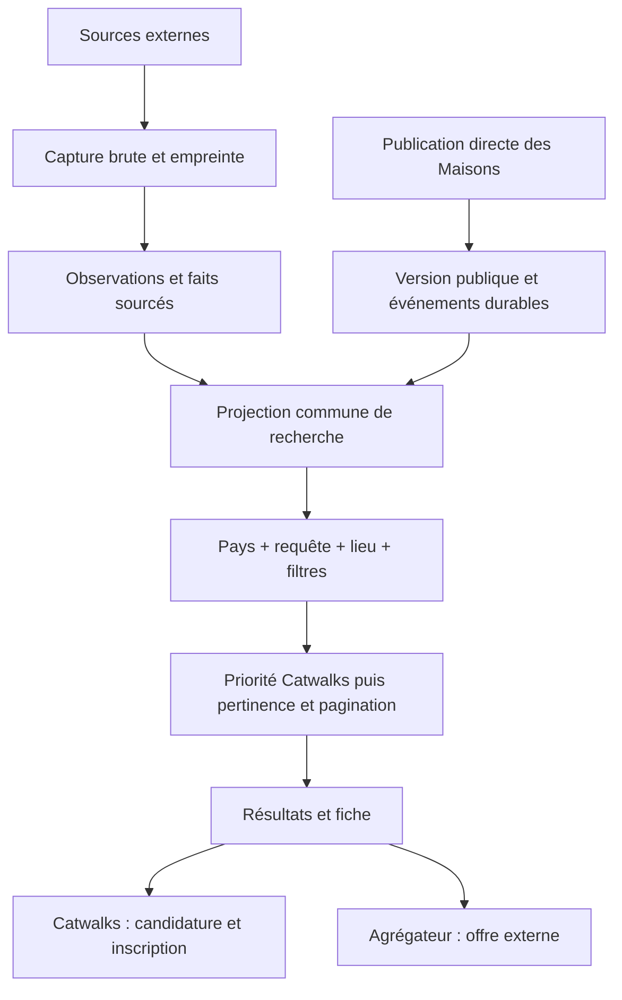

# Architecture Catwalks : collecte, catalogue et recherche par pays

Décision de travail du **15 septembre 2026**, fondée sur le code et l’[audit du stock réel](../../audits/reprise-2026-09-15/rapport.md). Ce document remplace l’ancienne architecture Mode Careers. Les sections « cible » décrivent les lots à construire, pas des fonctions déjà déployées. Le [plan de livraison](../../audits/reprise-2026-09-15/plan.md) porte leur validation.

## 1. Ce qui existe et ce qui manque

| Périmètre | Implémentation vérifiée | Écart à traiter |
|---|---|---|
| Collecte externe | `apps/aggregator`, 43 kinds au registre ; `Source`, `JobSource`, `SourceObservation` | Capture native ajoutée localement au lot 2 ; collecte de production encore historique et sources à qualifier |
| Catalogue externe | `packages/db` ; `Job` et ses représentations ; identité prouvée, groupes réversibles et présentation propre ajoutés localement aux lots 4A–4D3 | Stock historique à reprendre avant bascule ; le schéma `Job` reste une projection de groupe |
| API du catalogue | `apps/api`, service Railway `catwalks-api` | `marche` ne borne pas encore tous les résultats ; suggestions et facettes ne partagent pas un contrat strict |
| Site candidat | Dépôt privé `catwalks-front-end` ; `/emplois` et `/offres` | Deux circuits de lecture ; le catalogue commun décrit ci-dessous n’existe pas encore |
| Offres directes | Dépôt privé `catwalks-back-end` ; `Job`, publication, retrait, candidatures | Export public actuel plafonné à 500 ; pas de transfert durable vers l’index de recherche commun |
| Candidature Catwalks | `PostulerButton`, `PostulerModal`, API `/api/applications` | À préserver et brancher au résultat commun ; ne pas remplacer par un lien externe |
| Langues | Catalogues FR/EN du website | Entrée directe `/en` incohérente selon cookies ; autres langues pas encore livrées |
| Exploitation | Workers séparés, crons gelés ; images à des révisions identifiées | Répétitions de cycle complet et reprise après panne à valider avant activation ultérieure |

Le schéma courant reste [schema.prisma](../../packages/db/prisma/schema.prisma). Un nom de table historique décrit le stockage actuel, pas une décision de le conserver indéfiniment.

## 2. Autorité des données : la publication originale

**Une publication est identifiée par son origine et son identifiant natif.** Pour une source externe : source/tenant/identifiant. Pour une publication directe : identifiant du backend Catwalks, dans un espace de noms différent.



### Cible de données

- **Capture** : corps natif avant parsing, empreinte, date, URL et statut HTTP, version du collecteur ; conservation même en cas d’échec du lecteur. En-têtes d’authentification et cookies exclus. Stockage privé par contenu ; politique de rétention mesurée au lot 2.
- **Observation** : publication observée dans une capture, erreurs éventuelles, attestations successives. Une capture identique peut être partagée sans effacer les dates d’observation.
- **Fait** : valeur originale, chemin précis dans la capture, interprétation, version du lecteur. Une absence distingue non publié, non collecté, non interprété, invalide et contradictoire.
- **Enrichissement** : métier, synonymes, géocodage ou traduction, avec provenance et version. Un enrichissement ne remplace pas une déclaration de l’employeur.
- **Rapprochement** : identité commune prouvée, hypothèse ou rejet ; liens réversibles. Titre + ville + Maison ne suffisent pas à fusionner deux postes.
- **Projection** : document de recherche reconstruit depuis les publications et décisions. Ce document est optimisé pour la lecture ; il n’est pas une nouvelle vérité qui écrase les originaux.

Les identifiants stables, les codes pays et les URL SEO peuvent rester normalisés. Les contrats, diplômes et intitulés conservent leurs concepts locaux. Aucun passage obligatoire par un métier universel pour publier, rechercher ou suggérer une offre.

### Disponibilité implémentée au lot 1

Le [contrat partagé](../../packages/db/availability.ts) exige une offre active, non fusionnée et au moins une publication active sans échéance dépassée. Échéance et preuve vivent sur `JobSource` ; le RAW natif et son chemin justifient la date. Une capture partielle ne supprime pas une échéance prouvée. Une date sans heure suit la fin du jour partout dans le monde ; les valeurs hors plage de stockage restent natives, avec un statut explicite et aucun instant inventé.

Le lecteur d’échéance version 5 exclut `Flatchr.vacancy.end_date`, qui désigne la fin du contrat, et lit les échéances natives qualifiées de Greenhouse, Easycruit, TalentView et du JSON-LD Volcanic. Le [lot 4E1](../../audits/reprise-2026-09-15/lot-4e1.md) corrige aussi l’extraction des attributs HTML non cités. Les colonnes source ajoutées par la migration locale doivent être remplies depuis les RAW avant la bascule du stock ; la réparation des groupes ne les reconstruit pas.

Le [plan de reprise version 3](../../audits/reprise-2026-09-15/lot-4f1.md) exige une identité native vérifiable pour chaque preuve de date, même si le cache correspond déjà. Lorsqu’une capture est référencée, sa provenance, son adaptateur, sa sortie et son état de publication doivent également correspondre ; un échec ne permet aucun repli sur le RAW historique. La validation de provenance ne dispense pas de vérifier l’identité native avec le lecteur actuel. L’absence de description seule ne rend pas une identité invalide.

Les anciennes preuves qualifiées restent utilisables après une capture partielle ; seules les deux règles explicitement réfutées peuvent être retirées sans date de remplacement. Les pages avec examen non résolu sont bloquées. Le plan fige révision, état de source et URL native ; il est borné à 1 000 lignes et 32 Mo de RAW et sorties cumulés. Les archives sont préchargées avant les verrous, puis les preuves revalidées sous verrou. L’application idempotente ne modifie ni activité, ni contenu public, ni dates d’attestation. Sur la copie complète, 3 098 échéances ont été reprises ; 3 051 cas restent à qualifier. La bascule reste conditionnée par la reprise des groupes, les présentations et les lots suivants.

Le [lot 4F2](../../audits/reprise-2026-09-15/lot-4f2.md) partage la vérification du détail Workday entre collecte et reprise : l’identifiant, le chemin natif et l’origine doivent correspondre avant tout ajout de champs. Seule la casse du segment ASCII du portail peut varier sur les domaines Workday qualifiés ; les domaines personnalisés exigent une URL exacte. Le RAW et les URLs d’origine restent conservés. Les liens de hub iCIMS demandent encore une preuve native de leur relation ; aucun domaine fournisseur entier n’est implicitement autorisé.

La disparition exige une énumération complète et récente, lue depuis la capture admise, scellée et achevée de la source — la même chaîne que la publication — avec des identifiants natifs comparables. L’état ACTIVE du registre, un compteur de santé (`SourceRun`) ou un journal de diagnostic (`PipelineEvent`) ne suffisent pas et ne sont plus lus pour décider ; l’ancien nettoyage de génération a été supprimé en 5G3C. Une maintenance bornée fige preuve, capture attestante, état avant, conséquence et limites dans `MaintenancePlan` (manifeste version 4), immuable et chargé par empreinte ; elle revalide sous verrou et journalise chaque mutation ou saut avec `DataCorrection`. La reprise est idempotente. Les règles et commandes actuelles sont dans la [documentation ops](../../apps/aggregator/scripts/ops/README.md) et le [contrat d’ingestion](source-ingestion.md) ; les [preuves du lot 1](../../audits/reprise-2026-09-15/lot-1.md) et du [lot 5G3C](../../audits/reprise-2026-09-15/lot-5g3c.md) indiquent les limites et le statut local.

### Capture implémentée au lot 2

Le [contrat de capture et rétention](native-capture.md) décrit les réponses archivées avant parsing, les sorties immuables par offre, leur lien au catalogue, le rejeu hors ligne et le passage en archive après relecture vérifiée. Les anciennes sorties d’adaptateur restent explicitement historiques lorsqu’aucune réponse native n’existe. La qualification du champ par champ et des sources reste à achever dans les lots suivants.

## 3. Deux origines, une recherche et deux candidatures

### Responsabilités

Le backend Catwalks reste propriétaire des publications directes et des candidatures. L’agrégateur reste propriétaire des captures externes. Le catalogue de recherche reçoit **uniquement la projection publique** des offres directes : aucun CV, compte candidat, contact privé ou mandat interne.

La cible est un index PostgreSQL commun à l’API de recherche. Une autre technologie de recherche ne sera introduite qu’après mesure de pertinence et de charge. Fusionner deux pages déjà paginées dans le navigateur donnerait des totaux et un classement incorrects : l’union, les filtres et le tri doivent précéder la pagination.

### Contrat public cible

```ts
// Contrat à introduire avec son producteur et ses consommateurs au même lot.
type ApplicationAction =
  | { kind: 'CATWALKS'; jobId: string }
  | { kind: 'EXTERNAL'; url: string };
```

L’origine est explicite et validée. Elle ne se déduit ni d’un domaine d’URL ni d’un identifiant non préfixé. Le clic direct réutilise authentification, retour à l’offre, onboarding si nécessaire et modale existants. Le clic externe utilise une URL HTTP(S) validée ; il ne crée aucune candidature Catwalks. L’API de candidature revérifie l’éligibilité en temps réel.

### Synchronisation des publications directes

Une **outbox** est une table d’événements écrits dans la même transaction que la publication, la modification ou le retrait. C’est le mécanisme cible pour transférer les versions publiques sans perdre un changement entre deux services.

- Version monotone par offre ; déduplication par origine/ID/version ; ancienne version ignorée.
- Retrait explicite conservé pour empêcher la résurrection par un événement ancien.
- Reprise initiale paginée sur un instant/version borné, puis événements depuis ce point ; le plafond actuel de 500 n’est pas un export complet.
- Consommation authentifiée, acquittement après écriture ; reprise après panne, métrique de retard et rapprochement d’identifiants.
- Toute voie de mutation native doit produire l’événement : création, édition, changement de statut seul ou groupé, suppression et expiration.
- Le lot livre producteur, consommateur, reprise et réconciliation ensemble. Pas de table ajoutée sans consommateur. Les dates d’expiration sont aussi vérifiées à la lecture.

### Classement contractuel

1. Déterminer les offres éligibles : publiées, disponibles, compatibles avec le pays, la requête, le lieu et tous les filtres sélectionnés.
2. Parmi ces offres, placer toutes les offres Catwalks avant les offres externes.
3. Dans chaque origine : pertinence du titre, de l’employeur et du contenu, puis fraîcheur et identifiant stable pour départager.
4. Paginer selon ce même ordre, avec curseur lié aux filtres et à la version du catalogue.

Une offre native hors pays ou hors requête n’entre pas dans les résultats. Compteurs, facettes et suggestions partagent la population éligible des deux origines. Un doublon exact entre une offre directe et une représentation externe affiche la version Catwalks et sa candidature ; sa preuve externe reste conservée. Sans preuve exacte, les deux publications restent distinctes.

## 4. Pays actif, langue et domaine

### Vérification Indeed

Le [sélecteur officiel](https://www.indeed.com/m/countries) associe pays et langue et propose plusieurs langues pour certains pays, dont Belgique, Canada et Suisse. La [page française](https://fr.indeed.com/) expose les deux entrées métier/entreprise et localisation demandées. Consultation : 15 septembre 2026. L’ordre exact IP/cookies/compte n’est pas établi par ces pages et n’est pas présenté comme un fait sur Indeed.

### Décision Catwalks

Le **pays cible** décide du catalogue, des localisations, des facettes, des unités et des langues disponibles. La langue d’interface est stockée séparément ; elle ne peut jamais élargir les pays recherchés.

- Sur une adresse explicitement nationale, le pays de l’URL fait foi. Un lien partagé US reste US pour un visiteur en France.
- Sur l’entrée neutre : choix utilisateur mémorisé, sinon pays IP fourni par un proxy de confiance, sinon sélection explicite de pays. Ne pas croire un en-tête de géolocalisation fourni librement par le navigateur.
- Premier accès dans un pays : langue par défaut de son profil. Pour un pays multilingue, préférence disponible dans ce pays, puis défaut documenté.
- Changement manuel de pays : URL nationale correspondante, nouvelle langue par défaut du pays, nouvelles suggestions/facettes ; lieu, curseur et filtres incompatibles supprimés. La requête textuelle est conservée.
- Un choix explicite de langue disponible dans le pays ne change pas les offres. Retour navigateur, liens et cache doivent restituer le même contexte.
- Une IP inconnue, un VPN ou un marché non ouvert ne déclenchent jamais une recherche mondiale silencieuse. Une indisponibilité de langue ne doit pas être déguisée en interface traduite.

**Adresses recommandées :** `{pays}.catwalks.io`, par exemple `fr.catwalks.io`, `us.catwalks.io`, `gb.catwalks.io`, `ca.catwalks.io`. `en` désigne une langue et ne suffit pas à identifier US, GB ou CA. Dans les pays multilingues, une URL de langue explicite complète le pays. Le domaine racine reste une décision de bascule ; aucun DNS n’est modifié par ce document.

La bascule devra inclure cookies/session, CORS, cache CDN, retours de connexion, canonical, hreflang, sitemap, anciennes URL et absence de boucle de redirection. Seules les versions réellement traduites sont annoncées aux moteurs. Le pays du contexte n’est jamais un simple conseil de classement SQL : **il borne les résultats**.

## 5. Les deux entrées de recherche

### Métier, mots-clés ou entreprise

- Recherche dans les intitulés natifs, employeurs et texte des offres éligibles du pays.
- Suggestions calculées depuis le stock actif des deux origines ; aucun catalogue de métiers déconnecté des offres.
- Homonymes d’employeurs distingués par ID ; noms et titres originaux conservés. Alias et traductions de requête mesurés, sans fabriquer une correspondance.
- Unicode, accents, écritures sans espaces et échappement des jokers SQL testés sur un corpus local par pays.

### Ville, division administrative, code postal ou télétravail

- Suggestions structurées : type, ID, label, pays, région et coordonnées seulement lorsqu’elles sont établies. **Aucun choix de pays dans cet input.**
- Le type de division suit le pays : département français, state américain, province canadienne, etc. Le code postal reste du texte pour conserver lettres et zéros initiaux.
- La saisie libre doit se résoudre dans le pays actif ou donner une absence de correspondance claire. Elle ne bascule jamais le pays implicitement.
- Deux Paris de pays différents restent distincts ; une ville sans pays ne reçoit pas un pays parce que le stock n’en contient aujourd’hui qu’un homonyme.
- Télétravail est un mode de travail, pas une ville. Une annonce n’est compatible avec le pays que si son lieu ou son périmètre de recrutement distant le prouve. « Remote » seul ne signifie pas « worldwide » ; hybride ne signifie pas 100 % distant.
- Référentiel géographique de pays pour les lieux valides, disponibilité des offres mesurée séparément. Les suggestions de titres, elles, proviennent exclusivement du stock actif.

## 6. Filtres adaptés aux pays et couverture honnête

Un profil de pays versionné déclare les dimensions comprises, leurs valeurs locales et les labels traduits. L’API publie disponibilité, effectifs, population mesurée et valeurs inconnues. Le website consomme ce contrat partagé ; pas de copie manuelle du registre.

| Dimension | Règle |
|---|---|
| Contrat | Concepts locaux conservés ; pas de conversion forcée en CDI/CDD |
| Temps de travail | Distinct du contrat et des programmes de formation |
| Stage / apprentissage / programme | Seulement si déclaré ; correspondances entre pays revues explicitement |
| Expérience | Années ou niveau déclarés ; une seniorité devinée dans le titre reste un enrichissement |
| Formation | Diplôme natif ; absence de diplôme requis distincte d’un champ absent |
| Salaire | Montant décimal, devise et période ; pas d’annualisation ni de conversion implicite |
| Sur site / hybride / distant | Déclarations et négations interprétées avec provenance ; conflit visible |
| Métier / univers | Aide à découvrir ; absence de classification ne retire pas l’offre de la recherche textuelle |

Les filtres se combinent en ET, plusieurs valeurs d’une dimension en OU. Un filtre sélectionné exige une correspondance démontrée ; une valeur inconnue n’est pas transformée en correspondance. Sans ce filtre, l’offre reste découvrable. Les facettes excluent leur propre sélection pour présenter les autres choix, avec les mêmes règles pour les deux origines.

Aucun seuil mondial unique ne doit masquer mécaniquement une dimension locale utile. Les filtres principaux suivent utilité locale, qualité prouvée et volume ; les autres dimensions fiables restent accessibles dans les filtres détaillés. Afficher une couverture plus haute en inventant des valeurs est interdit. Les pays couverts par la collecte et les interfaces complètement localisées sont deux métriques distinctes.

## 7. Un seul parcours pour les nouvelles sources

### État actuel vérifié

Le [parcours maintenu](source-onboarding.md) utilise `source-onboard.mts` : enregistrement DRAFT, profil, revue d’identité, collecte native, revalidation, statut et promotion. Les mutations exigent `--apply`, et la promotion une révision explicite. Les anciennes orchestrations P3/B6, leurs alias et le compteur manuel ont été retirés. La découverte demeure une inspection séparée sans certification.

Les décisions natives et d’identité sont immuables et liées à la révision du registre. Le statut expose séparément la preuve d’accès, encore héritée et non liée à cette révision. L’unification des commandes ne résout pas cette limite, ni la preuve du lien exact portail officiel → site ATS, les rôles d’éditeur ou la garde des ingestions déjà actives.

### Cible : dossier → preuve → validation → activation

1. **Découvrir** : enregistrer l’acteur, URL officielle, lien vers le portail, provenance et date. Détecter doublons de tenant/portail et couverture par un groupe avant d’ajouter une source.
2. **Préparer** : choisir un adaptateur existant et sa configuration validée par schéma. Créer une DRAFT sans collecte générale ni publication. Un nouvel ATS demande un adaptateur et ses fixtures ; une nouvelle Maison d’un ATS connu demande une configuration et ses preuves.
3. **Capturer** : lire depuis l’environnement d’exécution prévu, dans un périmètre borné, archiver la réponse avant parsing et les preuves d’identité/d’accès. Mesurer première/dernière page, IDs uniques, détail, comptes, limites, durée, coût et erreurs.
4. **Valider** : rejouer les captures hors réseau avec le même moteur que l’ingestion ; rapprocher IDs source, publications persistées et IDs publics ; vérifier employeur, lieux/pays, candidature externe, dates, champs natifs et exclusions motivées.
5. **Certifier** : rapport immuable identifié, lié au hash de configuration, au tenant, au commit du collecteur/lecteur, au corpus et à l’instant de contrôle. Verdicts séparés pour identité, accès, complétude et qualité des champs. Toute preuve manquante ou contradiction reste explicite.
6. **Activer** : transaction vers ACTIVE après contrôle des dernières décisions de la révision explicitement sélectionnée. La qualification native est un rapport distinct et ne change pas le statut opérationnel ; le statut historique VALIDATED n’est pas une preuve. L’activation exige la révision attendue ; aucun nombre d’offres affirmé sur la ligne de commande ne vaut preuve. Un portail réellement vide peut être validé si son identité et son énumération vide sont prouvées.
7. **Surveiller** : chaque run renouvelle son droit d’attester l’absence ; ACTIVE n’accorde pas ce droit à lui seul. Changement de tenant/configuration ou de lecteur touchant les preuves → revalidation. Échec réseau → dégradation/suspension, jamais fermeture employeur inventée.

La validation produit des **ensembles d’identifiants et des raisons d’écart**, pas seulement des totaux égaux. Une source peut être utile à la collecte tout en étant incapable d’attester des absences ; sa politique de vieillissement doit l’indiquer. Le rapport doit permettre de décider sans ouvrir dix scripts ou reconstituer des valeurs à la main.

Les 536 entrées existantes passent par les mêmes contrôles, en priorité sources cassées puis volumes sans preuve complète. Aucun contournement spécial pour les sources historiques. Les recettes de test restent des fixtures de la commande commune ; aucune commande de lot datée ne devient un second pipeline de production.

## 8. Traduction

Préférence utilisateur : utiliser le système d’Indeed si son identité et son adéquation sont établies. La documentation [Indeed Design](https://indeed.design/article/globalizing-your-ux-designs/) décrit une collaboration avec les équipes de localisation et les experts de contenu ; elle n’identifie pas un fournisseur unique de traduction automatique. Les sources publiques consultées ne permettent pas non plus de confirmer l’assemblage exact « moteur maison Indeed, gettext/ICU, bundles JS et React/SSR ». Cette description reste une hypothèse ; gettext et ICU sont des conventions distinctes. Un catalogue servi au navigateur explique l’affichage des traductions, pas leur production.

**Constat dans le website** : `src/lib/langue/messages/{fr,en}.ts` contient déjà des catalogues versionnés. Le traducteur de `messages/index.ts` résout une clé avec repli FR ; sa signature ne prend aucun paramètre de pluriel ou d’interpolation. `AppliquerLangue.tsx` ajuste encore l’attribut `lang` côté client. Ces chemins ne constituent pas une internationalisation serveur complète et leurs commentaires ne valent pas preuve du fonctionnement d’Indeed.

**Décision pour le lot langues** : migrer vers `next-intl`, adapté au Next.js existant, avec messages ICU et clés typées. Sa documentation décrit [les pluriels et paramètres ICU](https://next-intl.dev/docs/usage/translations) et [le rendu serveur et client](https://next-intl.dev/docs/environments/server-client-components). Le catalogue reste notre contenu versionné ; la bibliothèque assure son interprétation. Le serveur détermine la locale pour le HTML, les métadonnées et le rendu React ; le client reprend exactement ce contexte. Les composants interactifs reçoivent leurs libellés traduits ou les messages nécessaires, sans charger toutes les langues. Les caches distinguent pays, langue et recherche. Les anciens traducteurs et correctifs de langue après chargement sont supprimés avec leurs derniers appelants, après validation SSR, hydratation, navigation, accessibilité et SEO. Cette migration n’est pas encore implémentée.

- **Interface** : catalogues versionnés, clés, paramètres et pluriels vérifiés, terminologie Catwalks, contrôle des liens et tailles de texte. Une langue ouverte doit avoir un catalogue complet ; un repli technique est observable et ne remplace pas la validation de couverture. La navigation ne dépend pas d’une traduction réseau à chaque requête. La production des traductions se fait avant publication, avec révision et validation des catalogues.
- **Offres** : original immuable ; traduction dérivée optionnelle, avec langue source/cible, empreinte du contenu, fournisseur/modèle, version de glossaire et état de validation. Modifier l’original invalide sa traduction. Les faits de filtre restent attachés à l’original.
- **Requêtes** : alias ou traduction peuvent aider la pertinence ; ils passent par un corpus d’évaluation distinct et ne changent pas le pays.
- **Fournisseur** : choix au lot langues, après comparaison sur le corpus réel : montants, unités, lieux, marques, diplômes, négations, dates, qualité linguistique, coût et temps. Pas d’abonnement ou de copie du moteur Journal par simple supposition.

## 9. Suppression du legacy et conditions de sortie

Chaque lot retire ses anciens chemins après remplacement validé : code, exports, imports, dépendances, variables, scripts, tests périmés et documentation. Aucun alias conservé « au cas où » sans consommateur identifié et échéance de migration. Les migrations appliquées et preuves historiques ont une fonction de traçabilité ; elles ne sont pas des branches de runtime à maintenir.

`/offres` et son parcours de candidature sont **actifs et nécessaires**. Leur suppression serait une perte métier. La nouvelle promesse de cette page est un chantier ultérieur ; le catalogue commun doit préserver les liens et le parcours natif jusque-là.

Validation par lot : tests pertinents sur base jetable, témoin du défaut, contre-épreuve, audit des appelants, données avant/après si migration, documentation exacte, revue défensive, puis commit livrable. La commande [validate-local.mjs](../../apps/aggregator/scripts/validate-local.mjs) crée sa propre base et exécute les suites ; aucune URL de base fournie par l’appelant n’est utilisée.

Fin de phase : installation depuis un état nommé, migrations répétées sur clone, corpus multilingue, cohabitation des deux origines, retrait/expiration et reprise prouvés, build, inventaire de code mort traité, manifeste de release et vérifications après déploiement. Le site/backend/media restent locaux dans le périmètre actuel ; les modifications de l’agrégateur peuvent être poussées. La bascule des autres productions sera présentée avec son périmètre concret.

**Après cette phase : activation CRON, matching et nouvelle promesse de `/offres`.** Les crons restent gelés pendant la reprise.
