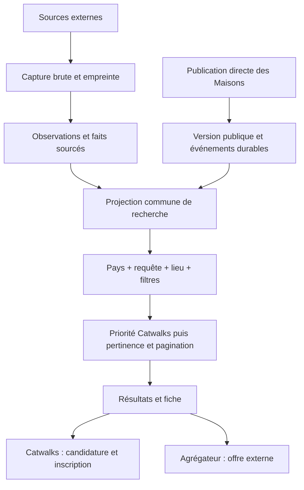

# Architecture Catwalks : collecte, catalogue et recherche par pays

Décision de travail du **15 septembre 2026**, fondée sur le code et l’[audit du stock réel](../../audits/reprise-2026-09-15/rapport.md). Ce document remplace l’ancienne architecture Mode Careers. Les sections « cible » décrivent les lots à construire, pas des fonctions déjà déployées. Le [plan de livraison](../../audits/reprise-2026-09-15/plan.md) porte leur validation.

## 1. État de départ des lots (relevé du 15/09/2026, complété jusqu’au lot 12, non tenu à jour)

| Périmètre | Implémentation vérifiée | Écart à traiter |
|---|---|---|
| Collecte externe | `apps/aggregator`, 43 kinds au registre ; `Source`, `JobSource`, `SourceObservation` | Capture native ajoutée localement au lot 2 ; collecte de production encore historique et sources à qualifier |
| Catalogue externe | `packages/db` ; `Job` et ses représentations ; identité prouvée, groupes réversibles et présentation propre ajoutés localement aux lots 4A–4D3 | Stock historique à reprendre avant bascule ; le schéma `Job` reste une projection de groupe |
| API du catalogue | `apps/api`, ancien service Railway `catwalks-api`, remplacé depuis par `catwalks-catalogue-api` (voir le [runbook courant](railway-runtime-reset.md)) ; depuis le lot 6A, périmètre obligatoire borné en SQL, suggestions et annuaire dans le périmètre, [contrat de facettes servi par le registre](recherche-marche.md) ; depuis le lot 6B (local), union des offres directes avant filtres, tri et pagination, espace `cw_`, `origine` et `candidature` explicites sur chaque ligne ; depuis le lot 7 (local), recherche par mots normalisée dans la base (vecteurs maintenus par déclencheurs, index GIN), score de pertinence, curseur `apres`/`suivant` ; depuis le lot 8 (local), libellés d’emploi, de pays et de langue dans la langue des libellés du marché (`fr`/`en`, nommée dans la réponse) ; depuis le lot 9 (local), `balisage` JobPosting sur la fiche et sitemap paginé du stock éligible (`/api/sitemap/emplois`) ; depuis le lot 12 (local), service API seul : modules Intelligence, dépendances et ressources d’interface de Mode Careers retirés, CSP réduite à ce que le service sert | Libellés de métier et de secteur français partout ; marchés DE/IT/ES/NL/CN libellés en français faute de relevé natif ; révision déployée antérieure au lot 6 ; la base Railway du service est en retard de migrations sur la branche. Dépassé au 24/09/2026 : voir l’état ci-dessous. |
| Site candidat | Dépôt privé `catwalks-front-end` ; `/emplois` et `/offres` ; sur `development` du site, non déployé : `/emplois` lit `GET /api/marches` et le contrat de facettes, exige un périmètre à l’écran (URL, sinon pays du visiteur, sinon invite à choisir), nomme les filtres refusés et les offres non confirmées, branche l’action de candidature (Catwalks → parcours du site ; externe → lien), plus aucun registre local de marchés, de facettes ni de libellés ; au lot 7 (local), le chargement continu suit le curseur de l’API (`apres`/`suivant`), plus aucun numéro de page ; au lot 8 (local), le moteur parle la langue de l’interface (`fr`/`en`), le marché entraîne sa langue, le choix de marché est mémorisé, l’hôte par pays est lu ; au lot 9 (local), la fiche porte le JobPosting de l’API, redirige les identifiants historiques et `sitemap-emplois.xml` sert le stock éligible, hors index tant que `EMPLOIS_INDEXABLE` n’est pas posé | `/offres` (lecture directe de Neon) reste le second circuit jusqu’au lot 12 ; `noindex` jusqu’au cutover ; déploiement Vercel non fait. Dépassé au 24/09/2026 : voir l’état ci-dessous. |
| Offres directes | Dépôt privé `catwalks-back-end` ; `Job`, publication, retrait, candidatures ; en local au lot 6B : `jobs.country_code`, `catalogue_version`, outbox `catalogue_outbox` par déclencheurs, flux `GET /api/catalogue/flux` sous clé, consommateur `direct-sync` côté agrégateur | Migration et flux non déployés, non committés dans le dépôt backend (chantier D-425 du propriétaire sur les mêmes fichiers) ; export public plafonné à 500 encore en place ; fréquence de consommation à décider (D-423). Dépassé au 24/09/2026 : voir l’état ci-dessous. |
| Candidature Catwalks | `PostulerButton`, `PostulerModal`, API `/api/applications` | À préserver et brancher au résultat commun ; ne pas remplacer par un lien externe |
| Langues | Catalogues FR/EN du website | Entrée directe `/en` incohérente selon cookies ; autres langues pas encore livrées. Dépassé au 24/09/2026 : voir l’état ci-dessous. |
| Exploitation | Workers séparés, crons gelés ; images à des révisions identifiées | Répétitions de cycle complet et reprise après panne à valider avant activation ultérieure. Dépassé au 24/09/2026 : voir l’état ci-dessous. |

**État au 24/09/2026**, vérifié ce jour dans Git, par les routes publiques et en lecture seule sur la base de production. Il remplace les colonnes dépassées du tableau.

- **API du catalogue** : la production sert `c62a534` (`/api/health` ; reçu dans [runtime-release.json](../operations/railway/runtime-release.json)), qui est aussi la `main` de l’agrégateur. Les libellés d’interface de l’API existent dans 25 langues (`LANGUES_LIBELLES` ; `packages/db/data/facet-labels.json` et `employment-labels.json`, 25 langues chacun) ; 62 métiers et 15 secteurs ont des traductions complémentaires en 23 langues, hors français et anglais (`apps/api/lib/data/taxonomy-labels.json`). La base de production a 90 migrations appliquées, la dernière étant `20260924130000_search_market_index` ; cette release n’en ajoute aucune.
- **Site candidat** : la branche `development` du site est en `7ec15ca`, avec 25 catalogues d’interface (`src/lib/langue/messages/*.json`), non déployée. Sa `main` (`38883a0`) ne contient ni `/emplois`, ni le groupe `(site)`, ni `src/lib/langue`, et `catwalks.io/emplois` répond 404. `38883a0` annule la promotion `e2e3a64`, qui est aussi la base commune de `main` et `development` : une simple fusion de `development` dans `main` ne ramènerait pas ce lot (fusion simulée hors du dépôt).
- **Indexation** : « `noindex` jusqu’au cutover » est remplacé par R-124 (D-441, amendée par D-446 et D-448 §3). L’ouverture est décidée à la sortie du site, par vagues : vague 1, les fiches du marché France et les fiches Catwalks, quel que soit leur pays. Non implémentée : le site ne connaît que le drapeau global `EMPLOIS_INDEXABLE`, qui ouvrirait d’un coup les fiches des 41 marchés, la liste et l’annuaire (`index, follow`) ; il ne doit pas être posé. `/offres/*` redirigera en 301 vers son équivalent `/emplois` le jour de la sortie (D-446 §3, R-124 §5) et une fiche vivra sur le sous-domaine du pays de son offre (D-448 §3) : décidés, non implémentés. `directApply` vaut `false` pour toute offre (D-450 §4) et l’employeur déclaré d’une offre Catwalks est « Catwalks » (D-455 §2) dans l’agrégateur, committé sur `development` le 25/09/2026 ; livraison en production : voir le reçu de release (`docs/operations/railway/runtime-release.json`) ; sans effet visible avant la sortie du site, seule à servir `/emplois`. Le détail, règle par règle, est dans [recherche-marche.md](recherche-marche.md), section « SEO du catalogue ».
- **Offres directes** : `DirectOffer`, `DirectOfferEvent` et `DirectFeedCursor` comptent 0 ligne en production. La migration `20260916170000_catalogue_outbox_d423` et le flux sont sur `development` du backend (`45a9b23`, `18511f1`), absents de sa `main` (`63f61fa`) ; le flux du backend de production répond 404. Le [contrat d’exécution Railway](../operations/railway/runtime-target.json) exclut Direct Offers (`scope.excluded`) ; son garde refuse `direct-sync` sur un worker en marche, et les variables `CATALOGUE_FLUX_*` sur l’API comme sur le worker. L’export public du backend reste plafonné à 500 (`src/app/api/jobs/route.ts`). D-444 (24/09/2026) a tranché : les offres Catwalks sortiront avec `/emplois`, par une relecture de cette liste publique toutes les 5 minutes, sans le flux d’outbox ni aucun changement du backend, de Neon ou de Vercel côté backend ; décidé, non implémenté (détail dans [recherche-marche.md](recherche-marche.md), section « Deux origines, une recherche »). D-446 §3 a décidé la redirection 301 de `/offres/*` vers `/emplois`, non implémentée. D-455 §1 a décidé que l’employeur affiché d’une offre Catwalks sans Maison publique sera « Catwalks », compté sous une seule ligne de l’annuaire ; codé avec la re-projection du stock, committé sur `development` le 25/09/2026 ; livraison en production : voir le reçu de release (`docs/operations/railway/runtime-release.json`) ; sans effet en production tant qu’aucune offre directe n’y est chargée (D-444).
- **Exploitation** : d’après le reçu de release, le worker de production est en `2cc91d8` et le RUN quotidien est configuré à 18 h Europe/Paris, une exécution par jour (bloc `schedule`).
- **Parcours candidat, décidé le 24/09/2026, non implémenté** : une seule page Emploi pour `/emplois`, `/offres` et `/mes-jobs`, dont seul l’état de connexion changera ce qui est proposé (D-447 §3) ; un seul comportement de « Postuler » : il ouvrira la création de compte, et un visiteur non connecté suivra l’onboarding existant, en français pour tous à la sortie, avant la candidature interne ou le bouton « Continuer ma candidature chez {Maison} », qui laissera une trace (D-447 §4, D-449 §2 et §3, D-450 §2 et §3 ; au commit `7ec15ca` du site, le lien externe est libre) ; l’onboarding international suivra en lot dédié (D-449 §2) ; à l’entrée `catwalks.io`, le dernier marché choisi, puis l’IP, puis une page « Choisissez votre pays », jamais l’IP sur une adresse explicite (D-447 §1, D-450 §1, R-123 amendée ; au commit `7ec15ca`, le choix mémorisé passe déjà avant l’IP, mais pour une seule adresse, et le chemin nu d’une fiche est encore redirigé selon l’IP) ; chaque marché sur son sous-domaine, fiches comprises (D-448 §3) ; une session commune à tous les marchés (D-448 §2, section 4) ; des préférences qui seront des recherches sauvegardées dans un marché, dans le vocabulaire du moteur `/emplois` (D-448 §4). D-448 lève le gel du groupe `(candidat)` pour ce lot. Chaque geste de production (DNS, domaines Vercel, CORS, cookie, Search Console, table des 301) part sur GO explicite, jamais pendant le RUN de 18 h.
- **Matching** : D-447 a décidé de le remplacer par ces préférences. Seul geste exécuté : la vague d’e-mails `MASTER_JOB_MATCH_01` a été arrêtée le 24/09/2026 à 19:23:30 UTC (D-448 §1). Décidé ensuite : le digest quotidien reste tel quel jusqu’à la livraison des alertes sur recherches sauvegardées, puis basculera le même jour (D-449 §1, bascule non implémentée) ; D-451 §1 ferme l’acquisition du vivier par e-mail (plus aucune campagne vers le vivier) ; une préférence rejouera exactement la recherche `/emplois`, sans score ni affinité de marque (D-451 §2, non implémenté). Restent à instruire : la purge des données de matching, le sort de la garde « prête pour le matching » (D-401) et le retrait des règles R-118, R-82 et R-83 (D-451).

Le schéma courant reste [schema.prisma](../../packages/db/prisma/schema.prisma). Un nom de table historique décrit le stockage actuel, pas une décision de le conserver indéfiniment.

## 2. Autorité des données : la publication originale

**Une publication est identifiée par son origine et son identifiant natif.** Pour une source externe : source/tenant/identifiant. Pour une publication directe : identifiant du backend Catwalks, dans un espace de noms différent.



### Cible de données

- **Capture** : corps natif avant parsing, empreinte, date, URL et statut HTTP, version du collecteur ; conservation même en cas d’échec du lecteur. En-têtes d’authentification et cookies exclus. Stockage privé par contenu ; politique de rétention mesurée au lot 2.
- **Observation** : publication observée dans une capture, erreurs éventuelles, attestations successives. Une capture identique peut être partagée sans effacer les dates d’observation.
- **Fait** : valeur originale, chemin précis dans la capture, interprétation, version du lecteur. Une absence distingue non publié, non collecté, non interprété, invalide et contradictoire.
- **Enrichissement** : métier, synonymes, géocodage ou traduction, avec provenance et version. Un enrichissement ne remplace pas une déclaration de l’employeur.
- **Rapprochement** : identité commune prouvée, hypothèse ou rejet ; liens réversibles. Titre + ville + Maison ne suffisent pas à fusionner deux postes.
- **Projection** : document de recherche reconstruit depuis les publications et décisions. Ce document est optimisé pour la lecture ; il n’est pas une nouvelle vérité qui écrase les originaux.

Les identifiants stables, les codes pays et les URL SEO peuvent rester normalisés. Les contrats, diplômes et intitulés conservent leurs concepts locaux. Aucun passage obligatoire par un métier universel pour publier, rechercher ou suggérer une offre.

### Disponibilité implémentée au lot 1

Le [contrat partagé](../../packages/db/availability.ts) exige une offre active, non fusionnée et au moins une publication active sans échéance dépassée. Échéance et preuve vivent sur `JobSource` ; le RAW natif et son chemin justifient la date. Une capture partielle ne supprime pas une échéance prouvée. Une date sans heure suit la fin du jour partout dans le monde ; les valeurs hors plage de stockage restent natives, avec un statut explicite et aucun instant inventé.

Le lecteur d’échéance version 5 exclut `Flatchr.vacancy.end_date`, qui désigne la fin du contrat, et lit les échéances natives qualifiées de Greenhouse, Easycruit, TalentView et du JSON-LD Volcanic. Le [lot 4E1](../../audits/reprise-2026-09-15/lot-4e1.md) corrige aussi l’extraction des attributs HTML non cités. Les colonnes source ajoutées par la migration locale doivent être remplies depuis les RAW avant la bascule du stock ; la réparation des groupes ne les reconstruit pas.

Le [plan de reprise version 3](../../audits/reprise-2026-09-15/lot-4f1.md) exige une identité native vérifiable pour chaque preuve de date, même si le cache correspond déjà. Lorsqu’une capture est référencée, sa provenance, son adaptateur, sa sortie et son état de publication doivent également correspondre ; un échec ne permet aucun repli sur le RAW historique. La validation de provenance ne dispense pas de vérifier l’identité native avec le lecteur actuel. L’absence de description seule ne rend pas une identité invalide.

Les anciennes preuves qualifiées restent utilisables après une capture partielle ; seules les deux règles explicitement réfutées peuvent être retirées sans date de remplacement. Les pages avec examen non résolu sont bloquées. Le plan fige révision, état de source et URL native ; il est borné à 1 000 lignes et 32 Mo de RAW et sorties cumulés. Les archives sont préchargées avant les verrous, puis les preuves revalidées sous verrou. L’application idempotente ne modifie ni activité, ni contenu public, ni dates d’attestation. Sur la copie complète, 3 098 échéances ont été reprises ; 3 051 cas restent à qualifier. La bascule reste conditionnée par la reprise des groupes, les présentations et les lots suivants.

Le [lot 4F2](../../audits/reprise-2026-09-15/lot-4f2.md) partage la vérification du détail Workday entre collecte et reprise : l’identifiant, le chemin natif et l’origine doivent correspondre avant tout ajout de champs. Seule la casse du segment ASCII du portail peut varier sur les domaines Workday qualifiés ; les domaines personnalisés exigent une URL exacte. Le RAW et les URLs d’origine restent conservés. Les liens de hub iCIMS demandent encore une preuve native de leur relation ; aucun domaine fournisseur entier n’est implicitement autorisé.

La disparition exige une énumération complète et récente, lue depuis la capture admise, scellée et achevée de la source — la même chaîne que la publication — avec des identifiants natifs comparables. L’état ACTIVE du registre, un compteur de santé (`SourceRun`) ou un journal de diagnostic (`PipelineEvent`) ne suffisent pas et ne sont plus lus pour décider ; l’ancien nettoyage de génération a été supprimé en 5G3C. Une maintenance bornée fige preuve, capture attestante, état avant, conséquence et limites dans `MaintenancePlan` (manifeste version 4), immuable et chargé par empreinte ; elle revalide sous verrou et journalise chaque mutation ou saut avec `DataCorrection`. La reprise est idempotente. Les règles et commandes actuelles sont dans la [documentation ops](../../apps/aggregator/scripts/ops/README.md) et le [contrat d’ingestion](source-ingestion.md) ; les [preuves du lot 1](../../audits/reprise-2026-09-15/lot-1.md) et du [lot 5G3C](../../audits/reprise-2026-09-15/lot-5g3c.md) indiquent les limites et le statut local.

### Capture implémentée au lot 2

Le [contrat de capture et rétention](native-capture.md) décrit les réponses archivées avant parsing, les sorties immuables par offre, leur lien au catalogue, le rejeu hors ligne et le passage en archive après relecture vérifiée. Les anciennes sorties d’adaptateur restent explicitement historiques lorsqu’aucune réponse native n’existe. La qualification du champ par champ et des sources reste à achever dans les lots suivants.

## 3. Deux origines, une recherche et deux candidatures

### Responsabilités

Le backend Catwalks reste propriétaire des publications directes et des candidatures. L’agrégateur reste propriétaire des captures externes. Le catalogue de recherche reçoit **uniquement la projection publique** des offres directes : aucun CV, compte candidat, contact privé ou mandat interne. D-444 (24/09/2026) précise le cas des mandats confidentiels de la liste publique : leur offre y entrera sans nom de Maison et hors de l’annuaire des Maisons (décidé, non implémenté).

La cible est un index PostgreSQL commun à l’API de recherche. Une autre technologie de recherche ne sera introduite qu’après mesure de pertinence et de charge. Fusionner deux pages déjà paginées dans le navigateur donnerait des totaux et un classement incorrects : l’union, les filtres et le tri doivent précéder la pagination.

### Contrat public cible

```ts
// Contrat à introduire avec son producteur et ses consommateurs au même lot.
type ApplicationAction =
  | { kind: 'CATWALKS'; jobId: string }
  | { kind: 'EXTERNAL'; url: string };
```

L’origine est explicite et validée. Elle ne se déduit ni d’un domaine d’URL ni d’un identifiant non préfixé. Le clic direct réutilise authentification, retour à l’offre, onboarding si nécessaire et modale existants. Le clic externe utilise une URL HTTP(S) validée ; il ne crée aucune candidature Catwalks. L’API de candidature revérifie l’éligibilité en temps réel. D-447 §4 (24/09/2026) a décidé un seul comportement de « Postuler », quelle que soit la provenance : un visiteur non connecté créera un compte et suivra l’intégralité du parcours d’inscription, onboarding compris, avant que sa candidature se poursuive. D-450 §2 et §3 précisent : « Postuler » ouvrira la création de compte ; après l’onboarding, le candidat reviendra sur la fiche et continuera, pour une offre agrégée, par un bouton « Continuer ma candidature chez {Maison} » qui laissera une trace (D-449 §3), sans redirection automatique. Décidé, non implémenté : au commit `7ec15ca` du site, le lien externe est libre (`src/components/emplois/FicheEmploi.tsx:152-163`).

### Synchronisation des publications directes

Une **outbox** est une table d’événements écrits dans la même transaction que la publication, la modification ou le retrait. C’était le mécanisme cible de la décision de travail du 15/09 pour transférer les versions publiques sans perdre un changement entre deux services ; il existe sur `development` du backend et dans le consommateur `direct-sync`, jamais en production. D-444 (24/09/2026) a retenu pour la sortie une relecture de la liste publique du backend toutes les 5 minutes, sans outbox ni changement du backend (détail dans [recherche-marche.md](recherche-marche.md)) : décidé, non implémenté. La liste ci-dessous reste celle de la cible du 15/09.

- Version monotone par offre ; déduplication par origine/ID/version ; ancienne version ignorée.
- Retrait explicite conservé pour empêcher la résurrection par un événement ancien.
- Reprise initiale paginée sur un instant/version borné, puis événements depuis ce point ; le plafond actuel de 500 n’est pas un export complet.
- Consommation authentifiée, acquittement après écriture ; reprise après panne, métrique de retard et rapprochement d’identifiants.
- Toute voie de mutation native doit produire l’événement : création, édition, changement de statut seul ou groupé, suppression et expiration.
- Le lot livre producteur, consommateur, reprise et réconciliation ensemble. Pas de table ajoutée sans consommateur. Les dates d’expiration sont aussi vérifiées à la lecture.

### Classement contractuel

1. Déterminer les offres éligibles : publiées, disponibles, compatibles avec le pays, la requête, le lieu et tous les filtres sélectionnés.
2. Parmi ces offres, placer toutes les offres Catwalks avant les offres externes.
3. Dans chaque origine : pertinence du titre, de l’employeur et du contenu, puis fraîcheur et identifiant stable pour départager.
4. Paginer selon ce même ordre, avec curseur lié aux filtres et à la version du catalogue.

Une offre native hors pays ou hors requête n’entre pas dans les résultats. Compteurs, facettes et suggestions partagent la population éligible des deux origines. Cible de la décision de travail du 15/09, non implémentée : un doublon exact entre une offre directe et une représentation externe afficherait la version Catwalks et sa candidature, en conservant la preuve externe ; sans preuve exacte, les deux publications resteraient distinctes. État du code au 24/09/2026 : aucun rapprochement n’est tenté. La CTE `base` de `apps/api/lib/job-search-query.ts` unit les deux origines par `UNION ALL` (lignes 180 à 192) ; une offre présente dans les deux origines serait donc servie deux fois. Aucun cas n’existe en production, qui compte 0 `DirectOffer`.

**État au lot 6B (16 septembre 2026, local).** Le producteur (backend : colonne `country_code` géocodée, version monotone `catalogue_version`, outbox par déclencheurs sur toute écriture de `jobs`, reprise initiale par remplissage de l’outbox dans la migration, flux paginé sous clé), le consommateur (agrégateur : `direct-sync`, lecture stricte du contrat, une transaction par événement, curseur et trace immuable) et la lecture (API : union `DirectOffer` ∪ `Job` dans `lib/job-search-query.ts`, `origine` et `candidature` sur chaque ligne, espace `cw_` sur la fiche, le statut, les similaires, le bloc Maison, les suggestions, `/api/marches` et l’annuaire) existent et sont prouvés par exécution sur des bases jetables ([lot 6](../../audits/reprise-2026-09-15/lot-6.md)). Le contrat exact est dans [recherche-marche.md](recherche-marche.md). Non fait au lot 6B : le rapprochement de doublons entre origines, la traduction des libellés, le déploiement. Fait ensuite : le site (6C), et au lot 7 le curseur de pagination lié aux critères (clé ordonnée, jeton opaque, refus d’un jeton d’autres critères) qui remplace la page bornée. Le contrat `ApplicationAction` ci-dessus est réalisé sous le nom `candidature` avec trois cas (`CATWALKS`, `EXTERNE`, `AUCUNE`) : une source sans lien exploitable n’est pas un lien externe.

## 4. Pays actif, langue et domaine

### Vérification Indeed

Le [sélecteur officiel](https://www.indeed.com/m/countries) associe pays et langue et propose plusieurs langues pour certains pays, dont Belgique, Canada et Suisse. La [page française](https://fr.indeed.com/) expose les deux entrées métier/entreprise et localisation demandées. Consultation : 15 septembre 2026. L’ordre exact IP/cookies/compte n’est pas établi par ces pages et n’est pas présenté comme un fait sur Indeed.

### Décision Catwalks

Le **pays cible** décide du catalogue, des localisations, des facettes, des unités et des langues disponibles. La langue d’interface est stockée séparément ; elle ne peut jamais élargir les pays recherchés.

- Sur une adresse explicitement nationale, le pays de l’URL fait foi. Un lien partagé US reste US pour un visiteur en France.
- Sur l’entrée neutre : choix utilisateur mémorisé, sinon pays IP fourni par un proxy de confiance, sinon sélection explicite de pays. Ne pas croire un en-tête de géolocalisation fourni librement par le navigateur. D-447 §1 (24/09/2026, amende R-123) : `catwalks.io` sans marché renverra vers le sous-domaine du pays de l’IP, quelle que soit la langue du navigateur ; une adresse explicite (un sous-domaine pays, une fiche) ne sera jamais redirigée selon l’IP ; pour un inscrit, le marché de ses préférences primera. Décidé, non implémenté (état du site dans [recherche-marche.md](recherche-marche.md), « Périmètre obligatoire à l’écran »). D-450 §1 (24/09/2026) précise l’entrée : le dernier marché choisi explicitement, mémorisé sur tout `*.catwalks.io`, passera d’abord ; sinon le marché du pays de l’IP ; sinon une page « Choisissez votre pays » pour un pays sans marché. Le site de `7ec15ca` met déjà le choix mémorisé avant l’IP, mais pour une seule adresse ; la redirection de l’entrée vers les sous-domaines n’est pas implémentée.
- Premier accès dans un pays : langue par défaut de son profil. Pour un pays multilingue, préférence disponible dans ce pays, puis défaut documenté.
- Changement manuel de pays : URL nationale correspondante, nouvelle langue par défaut du pays, nouvelles suggestions/facettes ; lieu, curseur et filtres incompatibles supprimés. La requête textuelle est conservée. D-443 §1 (24/09/2026) amende ce point : changer de pays efface tout, mot-clé compris ; décidé, non implémenté au 24/09/2026 (le site conserve encore le mot-clé).
- Un choix explicite de langue disponible dans le pays ne change pas les offres. Retour navigateur, liens et cache doivent restituer le même contexte.
- Une IP inconnue, un VPN ou un marché non ouvert ne déclenchent jamais une recherche mondiale silencieuse. Une indisponibilité de langue ne doit pas être déguisée en interface traduite.

**Adresses recommandées :** `{pays}.catwalks.io`, par exemple `fr.catwalks.io`, `us.catwalks.io`, `gb.catwalks.io`, `ca.catwalks.io`. `en` désigne une langue et ne suffit pas à identifier US, GB ou CA. Dans les pays multilingues, une URL de langue explicite complète le pays. D-448 §3 (24/09/2026) a décidé que chaque marché vivra sur son sous-domaine, fiches comprises, et que `catwalks.io` ne gardera que l’entrée (D-447 §1) et des redirections 301 fondées sur le contenu (les 179 URL indexées, les liens des e-mails, les 301 de D-446). Décidé, non implémenté : `fr.catwalks.io` et `us.catwalks.io` n’avaient aucun enregistrement DNS le 24/09/2026. Aucun DNS n’est modifié par ce document.

La bascule devra inclure cookies/session, CORS, cache CDN, retours de connexion, canonical, hreflang, sitemap, anciennes URL et absence de boucle de redirection. Seules les versions réellement traduites sont annoncées aux moteurs. Le pays du contexte n’est jamais un simple conseil de classement SQL : **il borne les résultats**. Pour la session, D-448 §2 (24/09/2026) a décidé un cookie sécurisé posé par le backend, inaccessible au code de la page et valable sur `*.catwalks.io`, que le site enverra avec ses appels, avec des origines d’appel exactes et une protection contre les requêtes forgées ; chaque inscrit se reconnectera une fois. Décidé, non implémenté : au commit `7ec15ca` du site, la session est rangée dans le stockage du navigateur, propre à chaque adresse (`src/lib/auth/AuthContext.tsx:80`).

**État au lot 6A (16 septembre 2026).** Le périmètre borne les résultats, totaux, facettes, suggestions et annuaire de l’API ; un marché absent ou inconnu est refusé (`400`), un pays connu sans marché mesuré est servi comme périmètre d’un seul pays ; les filtres non servis et les pays hors périmètre sont refusés nommément ; les offres non renseignées sur une dimension filtrée restent servies et marquées non confirmées. Le contrat exact est décrit dans [recherche-marche.md](recherche-marche.md). L’union avec les offres directes est faite au lot 6B (section 3).

**État au lot 6C (16 septembre 2026, local, non déployé).** Le site candidat applique ce paragraphe sur `/emplois` et `/emplois/maisons` : le pays de l’URL fait foi (`?marche=XX`, partageable et identique pour tous) ; sur une entrée neutre, le pays du visiteur (en-tête de la plateforme) suggère un périmètre servi sans l’écrire dans les liens ; sans suggestion possible, la page demande un choix parmi les marchés du contrat, jamais une recherche mondiale ; un code inconnu du contrat mène à la même invite. Changer de marché passe par le sélecteur, qui lit la liste du contrat ; la recherche texte et le lieu survivent, les facettes non. La langue d’interface reste un axe séparé (sélecteur de langue). Fait au lot 8 (local, non déployé) : la mémorisation du choix de marché (cookie `CW_MARCHE`, entrée neutre), la lecture de l’hôte `<pays>.catwalks.*`, la langue d’interface entraînée par le marché, les libellés d’emploi dans la langue du marché (API). Non fait : les adresses par pays elles-mêmes (DNS, Vercel, CORS et cookie d’authentification du backend, redirection `www` du propriétaire), les catalogues d’interface au-delà de `fr`/`en`, toute traduction de contenu (cartes de décision au lot 8). Au 24/09/2026, 25 catalogues d’interface sont sur `development` du site (`7ec15ca`), non déployés : voir l’état au 24/09/2026 en section 1.

## 5. Les deux entrées de recherche

### Métier, mots-clés ou entreprise

- Recherche dans les intitulés natifs, employeurs et texte des offres éligibles du pays.
- Suggestions calculées depuis le stock actif des deux origines ; aucun catalogue de métiers déconnecté des offres.
- Homonymes d’employeurs distingués par ID ; noms et titres originaux conservés. Alias et traductions de requête mesurés, sans fabriquer une correspondance.
- Unicode, accents, écritures sans espaces et échappement des jokers SQL testés sur un corpus local par pays.

### Ville, division administrative, code postal ou télétravail

- Suggestions structurées : type, ID, label, pays, région et coordonnées seulement lorsqu’elles sont établies. **Aucun choix de pays dans cet input.**
- Le type de division suit le pays : département français, state américain, province canadienne, etc. Le code postal reste du texte pour conserver lettres et zéros initiaux.
- La saisie libre doit se résoudre dans le pays actif ou donner une absence de correspondance claire. Elle ne bascule jamais le pays implicitement.
- Deux Paris de pays différents restent distincts ; une ville sans pays ne reçoit pas un pays parce que le stock n’en contient aujourd’hui qu’un homonyme.
- Télétravail est un mode de travail, pas une ville. Une annonce n’est compatible avec le pays que si son lieu ou son périmètre de recrutement distant le prouve. « Remote » seul ne signifie pas « worldwide » ; hybride ne signifie pas 100 % distant.
- Référentiel géographique de pays pour les lieux valides, disponibilité des offres mesurée séparément. Les suggestions de titres, elles, proviennent exclusivement du stock actif.

## 6. Filtres adaptés aux pays et couverture honnête

Un profil de pays versionné déclare les dimensions comprises, leurs valeurs locales et les labels traduits. L’API publie disponibilité, effectifs, population mesurée et valeurs inconnues. Le website consomme ce contrat partagé ; pas de copie manuelle du registre.

| Dimension | Règle |
|---|---|
| Contrat | Concepts locaux conservés ; pas de conversion forcée en CDI/CDD |
| Temps de travail | Distinct du contrat et des programmes de formation |
| Stage / apprentissage / programme | Seulement si déclaré ; correspondances entre pays revues explicitement |
| Expérience | Années ou niveau déclarés ; une seniorité devinée dans le titre reste un enrichissement |
| Formation | Diplôme natif ; absence de diplôme requis distincte d’un champ absent |
| Salaire | Montant décimal, devise et période ; pas d’annualisation ni de conversion implicite |
| Sur site / hybride / distant | Déclarations et négations interprétées avec provenance ; conflit visible |
| Métier / univers | Aide à découvrir ; absence de classification ne retire pas l’offre de la recherche textuelle |

Les filtres se combinent en ET, plusieurs valeurs d’une dimension en OU. Un filtre sélectionné exige une correspondance démontrée ; une valeur inconnue n’est pas transformée en correspondance. Sans ce filtre, l’offre reste découvrable. Les facettes excluent leur propre sélection pour présenter les autres choix, avec les mêmes règles pour les deux origines.

Aucun seuil mondial unique ne doit masquer mécaniquement une dimension locale utile. Les filtres principaux suivent utilité locale, qualité prouvée et volume ; les autres dimensions fiables restent accessibles dans les filtres détaillés. Afficher une couverture plus haute en inventant des valeurs est interdit. Les pays couverts par la collecte et les interfaces complètement localisées sont deux métriques distinctes.

## 7. Un seul parcours pour les nouvelles sources

### État actuel vérifié

Le [parcours maintenu](source-onboarding.md) utilise `source-onboard.mts` : enregistrement DRAFT, profil, revue d’identité, collecte native, revalidation, statut et promotion. Les mutations exigent `--apply`, et la promotion une révision explicite. Les anciennes orchestrations P3/B6, leurs alias et le compteur manuel ont été retirés. La découverte demeure une inspection séparée sans certification.

Les décisions natives et d’identité sont immuables et liées à la révision du registre. Le statut expose séparément la preuve d’accès, encore héritée et non liée à cette révision. L’unification des commandes ne résout pas cette limite, ni la preuve du lien exact portail officiel → site ATS, les rôles d’éditeur ou la garde des ingestions déjà actives.

### Cible : dossier → preuve → validation → activation

1. **Découvrir** : enregistrer l’acteur, URL officielle, lien vers le portail, provenance et date. Détecter doublons de tenant/portail et couverture par un groupe avant d’ajouter une source.
2. **Préparer** : choisir un adaptateur existant et sa configuration validée par schéma. Créer une DRAFT sans collecte générale ni publication. Un nouvel ATS demande un adaptateur et ses fixtures ; une nouvelle Maison d’un ATS connu demande une configuration et ses preuves.
3. **Capturer** : lire depuis l’environnement d’exécution prévu, dans un périmètre borné, archiver la réponse avant parsing et les preuves d’identité/d’accès. Mesurer première/dernière page, IDs uniques, détail, comptes, limites, durée, coût et erreurs.
4. **Valider** : rejouer les captures hors réseau avec le même moteur que l’ingestion ; rapprocher IDs source, publications persistées et IDs publics ; vérifier employeur, lieux/pays, candidature externe, dates, champs natifs et exclusions motivées.
5. **Certifier** : rapport immuable identifié, lié au hash de configuration, au tenant, au commit du collecteur/lecteur, au corpus et à l’instant de contrôle. Verdicts séparés pour identité, accès, complétude et qualité des champs. Toute preuve manquante ou contradiction reste explicite.
6. **Activer** : transaction vers ACTIVE après contrôle des dernières décisions de la révision explicitement sélectionnée. La qualification native est un rapport distinct et ne change pas le statut opérationnel ; le statut historique VALIDATED n’est pas une preuve. L’activation exige la révision attendue ; aucun nombre d’offres affirmé sur la ligne de commande ne vaut preuve. Un portail réellement vide peut être validé si son identité et son énumération vide sont prouvées.
7. **Surveiller** : chaque run renouvelle son droit d’attester l’absence ; ACTIVE n’accorde pas ce droit à lui seul. Changement de tenant/configuration ou de lecteur touchant les preuves → revalidation. Échec réseau → dégradation/suspension, jamais fermeture employeur inventée.

La validation produit des **ensembles d’identifiants et des raisons d’écart**, pas seulement des totaux égaux. Une source peut être utile à la collecte tout en étant incapable d’attester des absences ; sa politique de vieillissement doit l’indiquer. Le rapport doit permettre de décider sans ouvrir dix scripts ou reconstituer des valeurs à la main.

Les 536 entrées existantes passent par les mêmes contrôles, en priorité sources cassées puis volumes sans preuve complète. Aucun contournement spécial pour les sources historiques. Les recettes de test restent des fixtures de la commande commune ; aucune commande de lot datée ne devient un second pipeline de production.

## 8. Traduction

Préférence utilisateur : utiliser le système d’Indeed si son identité et son adéquation sont établies. La documentation [Indeed Design](https://indeed.design/article/globalizing-your-ux-designs/) décrit une collaboration avec les équipes de localisation et les experts de contenu ; elle n’identifie pas un fournisseur unique de traduction automatique. Les sources publiques consultées ne permettent pas non plus de confirmer l’assemblage exact « moteur maison Indeed, gettext/ICU, bundles JS et React/SSR ». Cette description reste une hypothèse ; gettext et ICU sont des conventions distinctes. Un catalogue servi au navigateur explique l’affichage des traductions, pas leur production.

**Constat historique du 15 septembre 2026 dans le website** : `src/lib/langue/messages/{fr,en}.ts` contenait des catalogues versionnés. Le traducteur de `messages/index.ts` résolvait une clé avec repli FR ; sa signature ne prenait aucun paramètre de pluriel ou d’interpolation. `AppliquerLangue.tsx` ajustait l’attribut `lang` côté client. Ces chemins ne constituaient pas une internationalisation serveur complète et leurs commentaires ne valaient pas preuve du fonctionnement d’Indeed.

**Décision du 15 septembre 2026 pour le lot langues** : migrer vers `next-intl`, adapté au Next.js existant, avec messages ICU et clés typées. Sa documentation décrit [les pluriels et paramètres ICU](https://next-intl.dev/docs/usage/translations) et [le rendu serveur et client](https://next-intl.dev/docs/environments/server-client-components). Le catalogue reste notre contenu versionné ; la bibliothèque assure son interprétation. La décision prévoit que le serveur détermine la locale pour le HTML, les métadonnées et le rendu React, et que le client reprenne exactement ce contexte ; que les composants interactifs reçoivent leurs libellés traduits ou les messages nécessaires, sans charger toutes les langues ; que les caches distinguent pays, langue et recherche ; que les anciens traducteurs et correctifs de langue après chargement soient supprimés avec leurs derniers appelants, après validation SSR, hydratation, navigation, accessibilité et SEO.

**État de `development` au commit `7ec15ca` du site (24 septembre 2026), non déployé** : 25 catalogues JSON d’interface (`src/lib/langue/messages/*.json`) sont interprétés par `next-intl` (`createTranslator`, `NextIntlClientProvider`), avec des clés typées depuis `fr.json`. Le layout du groupe `(site)` rend `lang` et `dir` côté serveur ; le groupe `(candidat)`, gelé jusqu’à D-448 (24/09/2026), garde `lang="fr"`. L’ancien traducteur (`messages/index.ts`, `fr.ts`, `en.ts`, supprimés par `90a9917`) et `AppliquerLangue.tsx` (supprimé par `5bd2c6a`) n’existent plus. La `main` du site (`38883a0`, qui annule la promotion `e2e3a64`) ne contient pas ce lot. Ce paragraphe ne vérifie pas chacune des conditions de la décision : la validation SSR, hydratation, navigation, accessibilité et SEO n’est pas établie ici.

- **Interface** : catalogues versionnés, clés, paramètres et pluriels vérifiés, terminologie Catwalks, contrôle des liens et tailles de texte. Une langue ouverte doit avoir un catalogue complet ; un repli technique est observable et ne remplace pas la validation de couverture. La navigation ne dépend pas d’une traduction réseau à chaque requête. La production des traductions se fait avant publication, avec révision et validation des catalogues.
- **Offres** : original immuable ; traduction dérivée optionnelle, avec langue source/cible, empreinte du contenu, fournisseur/modèle, version de glossaire et état de validation. Modifier l’original invalide sa traduction. Les faits de filtre restent attachés à l’original.
- **Requêtes** : alias ou traduction peuvent aider la pertinence ; ils passent par un corpus d’évaluation distinct et ne changent pas le pays.
- **Fournisseur** : choix au lot langues, après comparaison sur le corpus réel : montants, unités, lieux, marques, diplômes, négations, dates, qualité linguistique, coût et temps. Pas d’abonnement ou de copie du moteur Journal par simple supposition.

## 9. Suppression du legacy et conditions de sortie

Chaque lot retire ses anciens chemins après remplacement validé : code, exports, imports, dépendances, variables, scripts, tests périmés et documentation. Aucun alias conservé « au cas où » sans consommateur identifié et échéance de migration. Les migrations appliquées et preuves historiques ont une fonction de traçabilité ; elles ne sont pas des branches de runtime à maintenir.

`/offres` et son parcours de candidature sont **actifs** : en production, `/offres` et ses fiches répondent 200 (24/09/2026). Leur suppression sèche serait une perte métier. Il n’y aura pas de promesse propre à `/offres` : `/emplois`, `/offres` et `/mes-jobs` reposeront sur une seule page Emploi (D-447 §3), et `/offres/*` redirigera en 301 vers son équivalent `/emplois` le jour de la sortie du site, avec sa table de correspondance (D-446 §3, R-124 §5), une fois les offres Catwalks présentes dans `/emplois` en production (D-444). Décidé, non implémenté. Le parcours de candidature Catwalks est conservé (D-447 §4). Jusqu’à cette sortie, le catalogue commun doit préserver les liens et le parcours natif.

Validation par lot : tests pertinents sur base jetable, témoin du défaut, contre-épreuve, audit des appelants, données avant/après si migration, documentation exacte, revue défensive, puis commit livrable. La commande [validate-local.mjs](../../apps/aggregator/scripts/validate-local.mjs) crée sa propre base et exécute les suites ; aucune URL de base fournie par l’appelant n’est utilisée.

Fin de phase : installation depuis un état nommé, migrations répétées sur clone, corpus multilingue, cohabitation des deux origines, retrait/expiration et reprise prouvés, build, inventaire de code mort traité, manifeste de release et vérifications après déploiement. Le site, le backend et le média ne sont pas promus en production dans le périmètre actuel : leurs lots vont sur `development`, sans push sur `main` ni déploiement sans GO explicite de Loïc ; l’agrégateur est promu selon son contrôle de release. La bascule des autres productions sera présentée avec son périmètre concret.

**Après cette phase, selon le plan du 15/09 : activation CRON, matching et nouvelle promesse de `/offres`.** Les crons restent gelés pendant la reprise. Au 24/09/2026, le RUN quotidien de collecte est configuré (section 1). Le reste du plan est remplacé par les décisions du 24/09/2026, non implémentées : pas de nouvelle promesse de `/offres`, qui redirigera en 301 vers `/emplois` (D-446 §3, D-447 §3) ; des préférences de recherche au lieu du matching (D-447, D-448 §4), dont la vague `MASTER_JOB_MATCH_01` a été arrêtée (D-448 §1), le reste du retrait étant à instruire puis à arbitrer (section 1).
