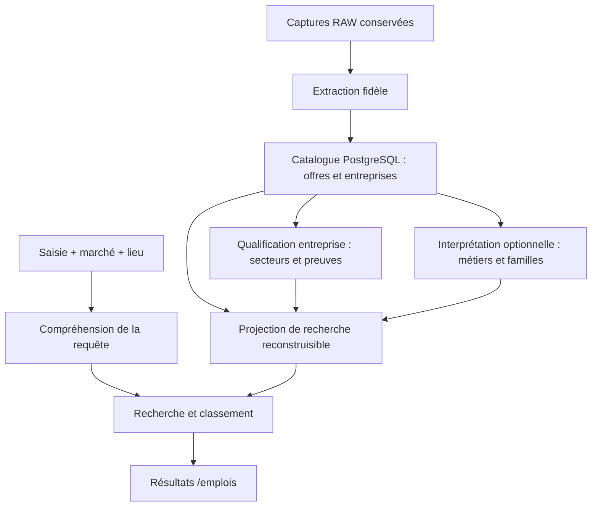

# Recherche Catwalks : métiers, Maisons et secteurs

## Statut et décision

Conception du 23 septembre 2026, fondée sur le code de production `92c2bb1` et des lectures du catalogue réel. L'audit initial et un essai de décomposition de requêtes sont réalisés. Aucun nouveau moteur, modèle IA, index ou changement d'interface n'est déployé dans ce lot.

**Elasticsearch est le candidat prioritaire à comparer à PostgreSQL enrichi.** La préférence porte sur ses capacités de recherche et de classement ; sa supériorité sur notre catalogue n'est pas encore mesurée. Aucun hébergement supplémentaire n'est engagé. Le choix final doit résulter d'un comparatif identique de pertinence, latence, fraîcheur et coût d'exploitation.

La recherche doit retrouver les offres pertinentes du marché actif même si elles n'ont aucun code métier. Les intitulés originaux restent affichés. Le filtre visible « Métier » doit sortir du parcours principal ; les concepts et familles restent utiles au moteur. Le secteur reste une donnée d'entreprise, sans rendre sa sélection obligatoire pour chercher. La refonte UI sera appliquée avec le skill Catwalks, dans le dépôt du site sur `development`.

La couverture se mesure séparément : (1) offres officielles accessibles et collectées ; (2) offres publiables présentes dans le catalogue ; (3) offres pertinentes retrouvées par la recherche. Un moteur de recherche ne peut pas retrouver une offre encore absente du catalogue, notamment Aesop/L'Oréal actuellement bloquée à la publication par HTTP 406.

## 1. Ce que fait réellement le système

### Secteurs

- La qualification structurée est **déjà portée par l'entreprise** : `Company.sectorCodes`, `sectorEvidence`, `sectorReviewId`, avec 15 `SectorConcept` et 12 décisions `SectorReview` observées.
- Le circuit [preview/apply des secteurs](../../apps/aggregator/src/sectors/review.ts) contrôle identité, codes, preuves, hash de l'état préalable et idempotence. Il faut le compléter, pas créer un second circuit de décisions concurrent.
- L'[ingestion](../../apps/aggregator/src/dedup/upsert.ts) calcule encore `classifySector` depuis chaque offre et remplit l'ancien `Company.sector` à la création. Cela ne renseigne pas `sectorCodes`, qui alimente la facette actuelle. Ses commentaires affirmant le contraire sont obsolètes.
- Au relevé du 23 septembre à 21:24:40 UTC : 834 entreprises sans secteur structuré, associées à 35 751 lignes Job actives ; 156 qualifiées, associées à 38 083 lignes actives. Ce comptage administratif `isActive` n'applique pas toutes les conditions de publication API et ne constitue pas le total public.
- Parmi les entreprises FR non qualifiées : Groupe MONOPRIX (695 offres actives), Mango (351), Nocibé (230). L'ancien enum peut être renseigné alors que `sectorCodes` est vide.

« 4 819 secteurs à vérifier » compte des **offres sans secteur structuré**, pas 4 819 catégories à créer. Le problème combine alimentation incomplète et présentation ambiguë.

### Métiers

La release active en base est `catwalks-occupations-20260909-v1` : 4 groupes, 27 familles, 61 métiers. Le fichier embarqué `occupations-v1.json` contient une autre release (`20260914-v2`, 62 métiers) ; sa présence ne prouve pas son activation. Le moteur charge la release active depuis la base.

| État des offres FR observées | Nombre |
|---|---:|
| Métier précis renseigné | 5 359 |
| Famille connue, métier précis absent | 5 635 |
| Aucune règle reconnue | 556 |
| Interprétation ambiguë | 15 |

La facette API « à préciser » atteint alors **6 206 offres**, dont 5 635 ont déjà une famille. Elle ne représente pas 6 206 métiers différents. On ne doit ni classifier artificiellement chacune de ces offres, ni les exclure de la recherche.

### Recherche

Le [SQL actuel](../../apps/api/lib/job-search-query.ts) utilise un index plein texte PostgreSQL, les titres, descriptions et identités d'entreprise, avec priorité aux offres Catwalks parmi les offres répondant à la recherche. Ce n'est pas une simple comparaison de chaînes exactes.

Mais [queryOccupations](../../packages/db/occupation-engine.ts) reconnaît un alias sur **la requête entière**. Il comprend un alias métier isolé, puis perd cette interprétation lorsque la saisie contient aussi une Maison ou un qualificatif. Familles et secteurs ne sont pas exploités comme des voies de recherche équivalentes. Le classement ajoute des poids simples titre/entreprise ; il ne suffit pas à contrôler les mentions accessoires dans les descriptions.

## 2. Essai réel : acquis et limites

24 recherches API ont été observées : 12 requêtes sur FR et US. Un prototype externe, en lecture seule, a ensuite séparé un alias métier et une Maison connue, puis appelé les filtres structurés existants. Il n'a modifié ni l'API ni les offres. Une hypothèse isolée ajoutait `retail advisor` comme alias de `sales-advisor`.

| Marché | Saisie | Recherche actuelle | Prototype par filtres stricts |
|---|---|---:|---:|
| FR | sales advisor Chanel | 0 | 22 |
| FR | conseiller de vente Chanel | 78 | 22 |
| US | conseiller de vente Chanel | 0 | 23 |
| US | sales advisor Chanel | 51 | 23 |
| FR | retail advisor | 63 | 3 866 |
| FR | conseiller de vente | 4 662 | 3 866 |
| US | joaillerie | 0 | 193 |

Ces résultats prouvent une faiblesse de composition et le potentiel de la couche sémantique. **Ils ne prouvent pas le rappel ni la pertinence de chaque résultat.** Les 78 résultats ne sont pas tous présumés pertinents, et les 22 ne sont pas présumés exhaustifs. Transformer systématiquement la saisie en `metier=...` exclut les offres sans classification et ne constitue pas la solution.

Sept variantes de « conseiller de vente » donnent les mêmes dix premiers identifiants dans le prototype ; les résultats échantillonnés restent dans le marché demandé. Cinq contrôles défensifs préservent notamment `senior`, `junior`, la négation et l'ambiguïté de `retail`, et empêchent de transformer « assistant store manager » en vendeur. Cela valide uniquement ce petit interpréteur expérimental.

Les latences API observées, 127–463 ms, sont des mesures unitaires en ligne. Elles ne sont ni un p95 sous charge, ni un benchmark Elasticsearch. Les compteurs sont des observations successives d'un catalogue vivant, sans snapshot transactionnel commun.

## 3. Architecture cible

### Comprendre la saisie sans perdre les mots

Décomposer indépendamment métier, entreprise/marque/groupe, secteur et précisions. La langue de la requête peut différer de la langue de l'interface et du marché : un candidat peut chercher « sales advisor » en France.

Pour « conseillère de vente Chanel », interroger les variantes linguistiques du rôle et l'identité Chanel en conservant la possibilité de retrouver un titre non classé. Pour « retail », conserver les différents sens possibles : activité d'entreprise et fonctions en magasin. Pour « joaillerie », utiliser le texte, les métiers du domaine et les secteurs d'entreprises vérifiés avec des poids distincts.

Ne pas confondre synonymes, métiers proches et hiérarchie : « store manager », « assistant store manager » et « sales advisor » ne sont pas des synonymes. Les expressions négatives ou non comprises ne perdent aucun terme silencieusement. Les corrections de fautes ne doivent pas remplacer une Maison valide par une autre.

### Retrouver puis classer

Réunir les candidats provenant du texte original, des alias multilingues, des concepts/familles optionnels et des relations d'entreprise vérifiées. L'absence de classification n'exclut aucune offre. Une expansion sémantique ne supprime pas les contraintes exprimées par la saisie ; des offres proches peuvent être présentées séparément si aucun résultat exact n'est disponible.

Appliquer marché, disponibilité et filtres explicites à toutes les voies, suggestions et facettes. Conserver les périmètres existants, dont GB/IE et DE/AT ; ne pas les réduire implicitement au seul code de l'URL. Une marque citée dans une description n'est pas automatiquement l'employeur. Une recherche libre « Chanel » ne doit donc pas être transformée aveuglément en filtre d'employeur unique.

Classer d'abord les offres éligibles : titre/identité réellement pertinents avant simple mention accessoire ; précision du rôle et du niveau conservée ; fraîcheur comme facteur secondaire. Préserver la priorité des offres Catwalks au sein des résultats pertinents et leurs parcours de candidature. Le modèle cible doit traiter les deux origines ; ce lot ne modifie pas le circuit Direct Offers gelé.

### Qualifier les entreprises une fois, puis maintenir

Réutiliser `SectorReview` : une IA propose des codes de la taxonomie depuis les informations et preuves de l'entreprise ; une recherche sur ses sites officiels complète les lacunes. Conserver contenu justificatif, URL, date, hash, version de taxonomie et version du modèle/prompt. Le contenu web reste une donnée, jamais une instruction exécutable.

Valider l'identité et les preuves par règles déterministes. Une confiance déclarée par le modèle ne suffit pas à auto-approuver : calibrer les critères sur un échantillon relu, autoriser l'abstention et réserver les cas contradictoires à une revue. Une preuve manquante ne bloque pas la publication des offres.

Déclencher au nouvel employeur, changement d'identité/preuves/taxonomie ou péremption définie ; dédupliquer par identité et version. Effectuer le rattrapage par lots reprenables, puis le traitement incrémental asynchrone, avec budget et limites réseau. Aucun appel IA obligatoire par offre ou par recherche utilisateur.

Séparer les activités d'une entreprise de ses formats commerciaux : « Retail » recoupe plusieurs verticales. Examiner les 15 concepts existants avant toute nouvelle taxonomie, sans multiplier les secteurs. Ne pas recopier tous les secteurs d'un groupe sur chacune de ses marques, ni qualifier les missions d'un poste à partir du seul secteur de l'employeur.

### Index dérivé si Elasticsearch est retenu

PostgreSQL reste le catalogue de référence ; Elasticsearch contient une projection remplaçable : identifiant stable, origine, titre brut, texte recherchable, employeur et relations prouvées, pays/localisation, dates et disponibilité, concepts optionnels, versions d'enrichissement et de document.

Prévoir une propagation durable des changements, idempotente et ordonnée par version, incluant fermetures, expirations, fusions, changements d'entreprise et retraits. Si un outbox est nécessaire, il appartient au même commit transactionnel que la mutation du catalogue ; pas de double écriture fragile « DB puis HTTP Elasticsearch ». Un rattrapage paginé et un point de reprise permettent de reconstruire l'index sans recollecter les sites.

Pendant le benchmark, vérifier aussi les changements qui n'émettent pas encore d'événement : expiration par horloge, relations d'entreprise ou règles de visibilité. Les offres périmées doivent être filtrées par leur date ; leur suppression asynchrone de l'index ne suffit pas. Après récupération d'identifiants, recontrôler la publiabilité en base avant exposition et mesurer les écarts de compteurs ; une divergence n'est pas présentée comme un total exact.

Versionner le schéma, les analyseurs et les synonymes. Reconstruire un nouvel index, contrôler sa couverture, puis basculer son alias ; les [alias Elasticsearch](https://www.elastic.co/docs/manage-data/data-store/aliases) permettent de remplacer plusieurs associations en une opération. L'ancien index est conservé pendant une fenêtre de rollback bornée, puis retiré. Curseurs et caches portent la version de recherche : aucun ancien curseur ne doit paginer un classement différent.

## 4. Comparatif technique

| Option | Capacités utiles | Coût architectural à mesurer | Position |
|---|---|---|---|
| PostgreSQL enrichi | Plein texte, dictionnaires/thésaurus, similarité de caractères avec `pg_trgm` | Compréhension et classement davantage à construire dans l'application ; charge partagée avec le catalogue | Référence à battre, pas écartée sur la seule taille du catalogue |
| Elasticsearch | Analyseurs linguistiques, synonymes multi-mots, champs pondérés, fautes de frappe, suggestions ; possibilité de recherche hybride | Nouveau service, synchronisation, réindexation, mémoire, disponibilité et fonctionnalités de l'offre retenue | Candidat prioritaire pour l'ambition mondiale de Catwalks |
| Typesense | Recherche avec tolérance aux fautes et réglage de pertinence par champs | Évaluer langues, classement métier, tris et mécanismes d'élargissement automatique avec nos contraintes | Alternative si le compromis exploitation/pertinence est meilleur ; pas de troisième intégration initiale |

PostgreSQL fournit des [dictionnaires et thésaurus](https://www.postgresql.org/docs/current/textsearch-dictionaries.html) et [pg_trgm](https://www.postgresql.org/docs/current/pgtrgm.html). Ces outils ne remplacent pas une décision sur le sens des mots.

Elasticsearch documente les [synonymes multi-mots au moment de la recherche](https://www.elastic.co/docs/solutions/search/full-text/search-with-synonyms), les [analyseurs linguistiques](https://www.elastic.co/docs/reference/text-analysis/analysis-lang-analyzer), la [tolérance aux fautes](https://www.elastic.co/docs/reference/query-languages/query-dsl/query-dsl-match-query) et la [recherche pendant la saisie](https://www.elastic.co/docs/reference/elasticsearch/mapping-reference/search-as-you-type). Les analyseurs ne traduisent pas automatiquement « vendeur » en « sales advisor » : il faut nos équivalences ou un modèle adapté.

La [recherche hybride](https://www.elastic.co/docs/solutions/search/hybrid-search) combine texte et proximité sémantique ; le [classement](https://www.elastic.co/docs/solutions/search/ranking) peut ensuite être affiné. C'est une option à mesurer après le socle lexical enrichi, pas une dépendance obligatoire au premier prototype. Version, fonctionnalités sous licence, modèle et coût d'inférence devront être fixés avant chiffrage. Aucune affirmation de gratuité ou de budget n'est faite ici.

Typesense permet de régler [pondération et pertinence](https://typesense.org/docs/guide/ranking-and-relevance.html). Ses mécanismes d'élargissement doivent être contrôlés pour ne jamais sacrifier une précision métier ou une Maison afin de produire davantage de résultats.

## 5. Suite par lots et critères de sortie

| Lot | Travail | Validation requise |
|---|---|---|
| S0 — constat | Audit code/base et essai de composition | Réalisé dans ce document ; pas de conclusion de pertinence globale |
| S1 — benchmark | Snapshot du catalogue publiable ; même contrat de requête et mêmes données pour PostgreSQL enrichi et Elasticsearch local | Jeu de requêtes évalué, limites identifiées, décision de moteur argumentée |
| S2 — compréhension | Décomposition métier/Maison/secteur/précisions, synonymes multilingues, récupération des offres non classées | Tests de pertinence et d'ambiguïté verts sur le moteur retenu |
| S3 — qualification | Qualification entreprise initiale puis incrémentale via le circuit existant ; enrichissement métier optionnel | Idempotence, preuve, abstention, reprise et coût mesurés |
| S4 — produit/index | Projection si nécessaire, suppression du filtre Métier dans l'UI, suggestions contextualisées | E2E `/emplois`, langues/marchés, facettes, pagination et deux origines sans régression |
| S5 — livraison | Comparaison de résultats avant exposition, audit défensif ciblé, bascule réversible et retrait du code remplacé | Critères fonctionnels et opérationnels atteints ; mise en production du site uniquement sur GO explicite |

S1 doit couvrir au moins les 27 familles présentes, les métiers fréquents et rares, les offres sans code, les requêtes composées, fautes, accents, formes féminines, niveaux hiérarchiques, négations, entreprises multimarques et langues croisées. Inclure FR/US, CA/CH/BE multilingues et des écritures non latines. Les résultats attendus sont annotés depuis le contenu natif ; notre classification actuelle ne sert pas d'oracle.

Constituer un jeu figé d'au moins 100 intentions et leurs variantes, avec exemples pertinents et contre-exemples. Former le pool depuis les sorties des moteurs, les titres bruts et un échantillon d'offres non classées, afin de limiter le biais du moteur actuel. Mesurer précision des dix premiers résultats, classement (`nDCG@10`) et rappel sur le pool annoté ; ne pas présenter ce dernier comme une preuve de rappel mondial absolu. Une requête qui possède un exemple pertinent connu ne doit plus retourner zéro.

Mesurer p50/p95, mémoire, taille d'index, durée et débit de réindexation, délai entre mutation et visibilité, reprise après interruption et coût complet. Cibles initiales proposées : p95 API ≤ 500 ms sous une charge documentée, zéro résultat hors marché, zéro offre fermée affichée, aucune disparition attribuable au seul code métier manquant. Les mesures actuelles ne valident pas ces objectifs.

Tester les plans de requête ambigus, les limites de taille, les caractères spéciaux et les valeurs liées ; ne jamais concaténer directement la saisie à du SQL ou à une syntaxe de requête exécutable. Vérifier suppressions/expirations, événements reçus hors ordre, reprise d'indexation, cohérence des facettes et invalidation des anciens curseurs.

Le retrait de legacy suit ses consommateurs : ancien classificateur de secteur, enum `Company.sector`, facette Métier et branches de recherche remplacées seulement après inventaire de leurs lectures réelles. Supprimer alors code, configuration, tests devenus sans objet et documentation contradictoire dans le même lot. Les migrations historiques restent des preuves de construction du schéma. `/offres`, matching et onboarding restent gelés.
